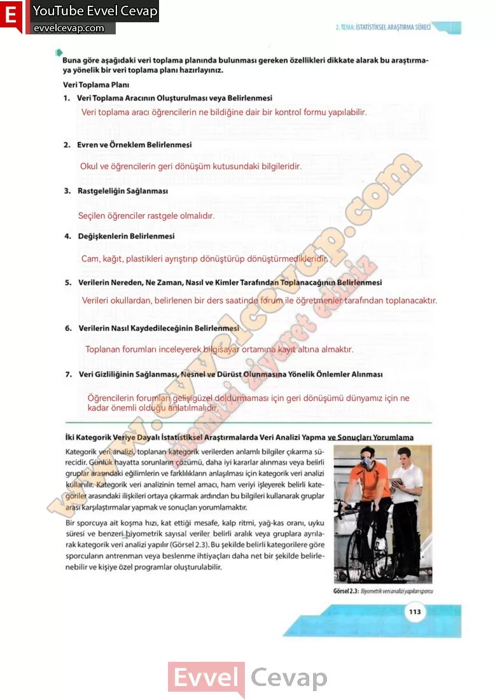

## 10. Sınıf Matematik Ders Kitabı Cevapları Meb Yayınları Sayfa 113

**Soru: Buna göre aşağıdaki veri toplama planında bulunması gereken özellikleri dikkate alarak bu araştırmaya yönelik bir veri toplama planı hazırlayınız.**

1. Veri Toplama Aracının Oluşturulması veya Belirlenmesi  
 2. Evren ve Örneklem Belirlenmesi  
 3. Rastgeleliğin Sağlanması  
 4. Değişkenlerin Belirlenmesi  
 5. Verilerin Nereden, Ne Zaman, Nasıl ve Kimler Tarafından Toplanacağının Belirlenmesi  
 6. Verilerin Nasıl Kaydedileceğinin Belirlenmesi  
 7. Veri Gizliliğinin Sağlanması, Nesnel ve Dürüst Olunmasına Yönelik Önlemler Alınması

**10. Sınıf Meb Yayınları Matematik Ders Kitabı Sayfa 113**