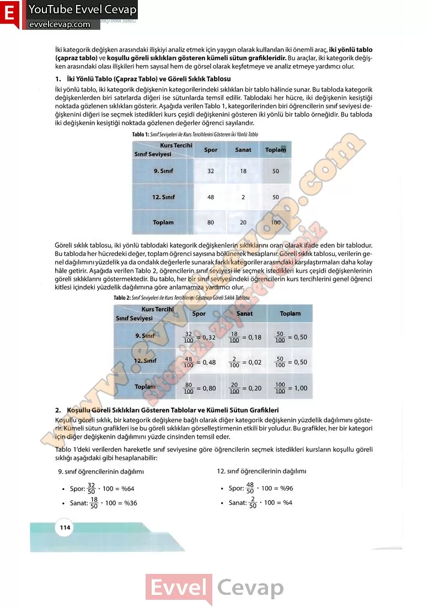

## 10. Sınıf Matematik Ders Kitabı Cevapları Meb Yayınları Sayfa 114

İki kategorik değişken arasındaki ilişkiyi analiz etmek için yaygın olarak kullanılan iki önemli araç, iki yönlü tablo (çapraz tablo) ve koşullu göreli sıklıkları gösteren kümeli sütun grafikleridir. Bu araçlar, iki kategorik değişken arasındaki olası ilişkileri hem sayısal hem de görsel olarak keşfetmeye ve analiz etmeye yardımcı olur.  
 1. İki Yönlü Tablo (Çapraz Tablo) ve Göreli Sıklık Tablosu  
 İki yönlü tablo, iki kategorik değişkenin kategorilerindeki sıklıkları bir tablo hâlinde sunar. Bu tabloda kategorik değişkenlerden biri satırlarda diğeri ise sütunlarda temsil edilir. Tablodaki her hücre, iki değişkenin kesiştiği noktada gözlenen sıklıkları gösterir. Aşağıda verilen Tablo 1, kategorilerinden biri öğrencilerin sınıf seviyesi değişkenini diğeri ise seçmek istedikleri kurs çeşidi değişkenini gösteren iki yönlü bir tablo örneğidir. Bu tabloda iki değişkenin kesiştiği noktada gözlenen değerler öğrenci sayılarıdır.

Göreli sıklık tablosu, iki yönlü tablodaki kategorik değişkenlerin sıklıklarını oran olarak ifade eden bir tablodur. Bu tabloda her hücredeki değer, toplam öğrenci sayısına bölünerek hesaplanır. Göreli sıklık tablosu, verilerin genel dağılımını yüzdelik ya da ondalık değerlerle sunarak farklı kategoriler arasındaki karşılaştırmaları daha kolay hâle getirir. Aşağıda verilen Tablo 2, öğrencilerin sınıf seviyesi ile seçmek istedikleri kurs çeşidi değişkenlerinin göreli sıklıklarını göstermektedir. Bu tablo, her bir sınıf seviyesindeki öğrencilerin kurs tercihlerini genel öğrenci kitlesi içindeki yüzdelik dağılımına göre anlamamıza yardımcı olur.

2. Koşullu Göreli Sıklıkları Gösteren Tablolar ve Kümeli Sütun Grafikleri  
 Koşullu göreli sıklık, bir kategorik değişkene bağlı olarak diğer kategorik değişkenin yüzdelik dağılımını gösterir. Kümeli sütun grafikleri ise bu göreli sıklıkları görselleştirmenin etkili bir yoludur. Bu grafikler, her bir kategori için diğer değişkenin dağılımını yüzde cinsinden temsil eder.  
 Tablo 1’deki verilerden hareketle sınıf seviyesine göre öğrencilerin seçmek istedikleri kursların koşullu göreli sıklığı aşağıdaki gibi hesaplanabilir:

* **Cevap**: **Bu sayfada soru bulunmamaktadır.**

**10. Sınıf Meb Yayınları Matematik Ders Kitabı Sayfa 114**