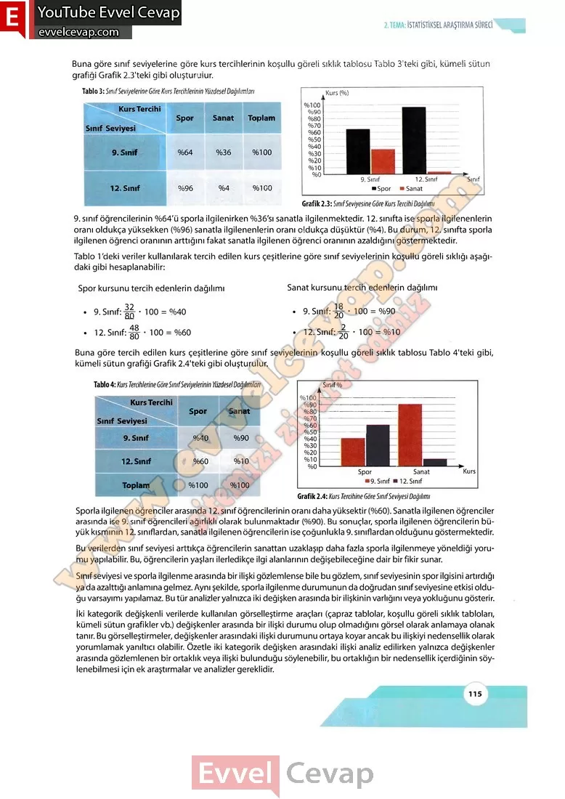

## 10. Sınıf Matematik Ders Kitabı Cevapları Meb Yayınları Sayfa 115

Buna göre sınıf seviyelerine göre kurs tercihlerinin koşullu göreli sıklık tablosu Tablo 3’teki gibi, kümeli sütun  
 grafiği Grafik 2.3’teki gibi oluşturulur.

9. sınıf öğrencilerinin %64’ü sporla ilgilenirken %36’sı sanatla ilgilenmektedir. 12. sınıfta ise sporla ilgilenenlerin oranı oldukça yüksekken (%96) sanatla ilgilenenlerin oranı oldukça düşüktür (%4). Bu durum, 12. sınıfta sporla ilgilenen öğrenci oranının arttığını fakat sanatla ilgilenen öğrenci oranının azaldığını göstermektedir.

Tablo 1 ‘deki veriler kullanılarak tercih edilen kurs çeşitlerine göre sınıf seviyelerinin koşullu göreli sıklığı aşağıdaki gibi hesaplanabilir:

Sporla ilgilenen öğrenciler arasında 12. sınıf öğrencilerinin oranı daha yüksektir (%60). Sanatla ilgilenen öğrenciler arasında ise 9. sınıf öğrencileri ağırlıklı olarak bulunmaktadır (%90). Bu sonuçlar, sporla ilgilenen öğrencilerin büyük kısmının 12. sınıflardan, sanatla ilgilenen öğrencilerin ise çoğunlukla 9. sınıflardan olduğunu göstermektedir.  
 Bu verilerden sınıf seviyesi arttıkça öğrencilerin sanattan uzaklaşıp daha fazla sporla ilgilenmeye yöneldiği yorumu yapılabilir. Bu, öğrencilerin yaşları ilerledikçe ilgi alanlarının değişebileceğine dair bir fikir sunar.  
 Sınıf seviyesi ve sporla ilgilenme arasında bir ilişki gözlemlense bile bu gözlem, sınıf seviyesinin spor ilgisini artırdığı ya da azalttığı anlamına gelmez. Aynı şekilde, sporla ilgilenme durumunun da doğrudan sınıf seviyesine etkisi olduğu varsayımı yapılamaz. Bu tür analizler yalnızca iki değişken arasında bir ilişkinin varlığını veya yokluğunu gösterir.  
 İki kategorik değişkenli verilerde kullanılan görselleştirme araçları (çapraz tablolar, koşullu göreli sıklık tabloları, kümeli sütun grafikler vb.) değişkenler arasında bir ilişki durumu olup olmadığını görsel olarak anlamaya olanak tanır. Bu görselleştirmeler, değişkenler arasındaki ilişki durumunu ortaya koyar ancak bu ilişkiyi nedensellik olarak yorumlamak yanıltıcı olabilir. Özetle iki kategorik değişken arasındaki ilişki analiz edilirken yalnızca değişkenler arasında gözlemlenen bir ortaklık veya ilişki bulunduğu söylenebilir, bu ortaklığın bir nedensellik içerdiğinin söylenebilmesi için ek araştırmalar ve analizler gereklidir.

* **Cevap**: **Bu sayfada soru bulunmamaktadır.**

**10. Sınıf Meb Yayınları Matematik Ders Kitabı Sayfa 115**