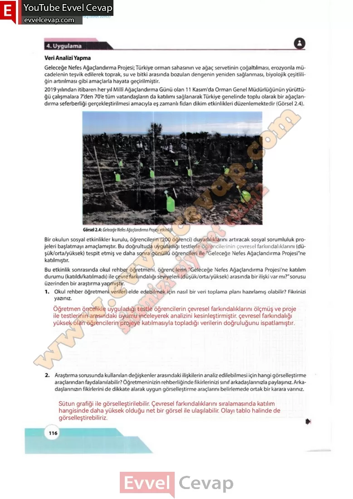

## 10. Sınıf Matematik Ders Kitabı Cevapları Meb Yayınları Sayfa 116

**4. Uygulama**

**Veri Analizi Yapma**

Geleceğe Nefes Ağaçlandırma Projesi; Türkiye orman sahasının ve ağaç servetinin çoğaltılması, erozyonla mücadelenin teşvik edilerek toprak, su ve bitki arasında bozulan dengenin yeniden sağlanması, biyolojik çeşitliliğin artırılması gibi amaçlarla hayata geçirilmiştir. 2019 yılından itibaren her yıl Millî Ağaçlandırma Günü olan 11 Kasım’da Orman Genel Müdürlüğünün yürüttüğü çalışmalara 7’den 70’e tüm vatandaşların da katılımı sağlanarakTürkiye genelinde toplu olarak bir ağaçlandırma seferberliği gerçekleştirilmesi amacıyla eş zamanlı fidan dikim etkinlikleri düzenlemektedir (Görsel 2.4).

Bir okulun sosyal etkinlikler kurulu, öğrencilerin (200 öğrenci) duyarlılıklarını artıracak sosyal sorumluluk projeleri başlatmayı amaçlamıştır. Bu doğrultuda uyguladığı testlerle öğrencilerinin çevresel farkındalıklarını (düşü k/orta/yüksek) tespit etmiş ve daha sonra gönüllü öğrencileri ile “Geleceğe Nefes Ağaçlandırma Projesi”ne katılmıştır. Bu etkinlik sonrasında okul rehber öğretmeni, öğrencilerin “Geleceğe Nefes Ağaçlandırma Projesi’ne katılım durumu (katıldı/katılmadı) ile çevre farkındalığı seviyeleri (düşük/orta/yüksek) arasında bir ilişki var mı?”sorusu üzerinden bir araştırma yapmıştır.

**Soru: 1) Okul rehber öğretmeni verileri elde edebilmek için nasıl bir veri toplama planı hazırlamış olabilir? Fikrinizi yazınız.**

**Soru: 2) Araştırma sorusunda kullanılan değişkenler arasındaki ilişkilerin analiz edilebilmesi için hangi görselleştirme araçlarından faydalanılabilir? Öğretmeninizin rehberliğinde fikirlerinizi sınıf arkadaşlarınızla paylaşınız. Arkadaşlarınızın fikirlerini de dikkate alarak uygun görselleştirme araçlarını belirlemede ortak bir karara varınız.**

**10. Sınıf Meb Yayınları Matematik Ders Kitabı Sayfa 116**