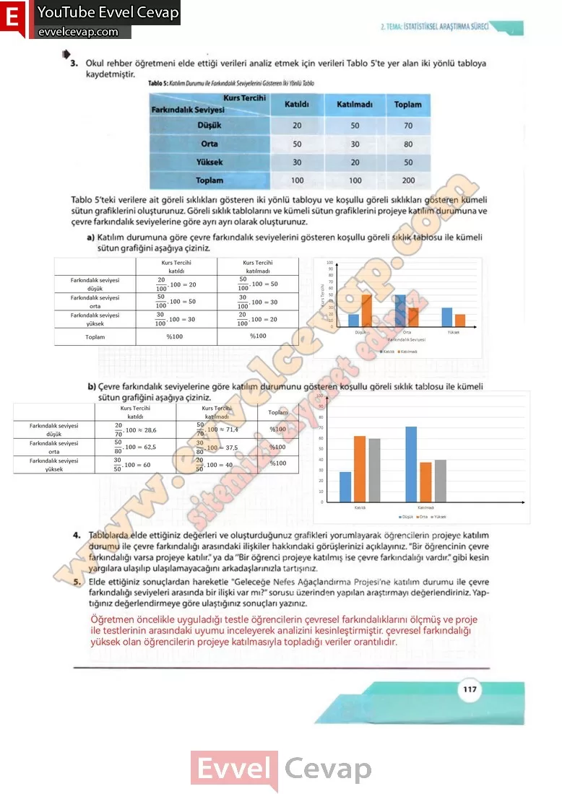

## 10. Sınıf Matematik Ders Kitabı Cevapları Meb Yayınları Sayfa 117

**Soru: 3) Okul rehber öğretmeni elde ettiği verileri analiz etmek için verileri Tablo 5’te yer alan iki yönlü tabloya kaydetmiştir. Tablo 5’teki verilere ait göreli sıklıkları gösteren iki yönlü tabloyu ve koşullu göreli sıklıkları gösteren kümeli sütun grafiklerini oluşturunuz. Göreli sıklık tablolarını ve kümeli sütun grafiklerini projeye katılım durumuna ve çevre farkındalık seviyelerine göre ayrı ayrı olarak oluşturunuz.**

**Soru: a) Katılım durumuna göre çevre farkındalık seviyelerini gösteren koşullu göreli sıklık tablosu ile kümeli sütun grafiğini aşağıya çiziniz.**

**Soru: b) Çevre farkındalık seviyelerine göre katılım durumunu gösteren koşullu göreli sıklık tablosu ile kümeli sütun grafiğini aşağıya çiziniz.**

**Soru: 4) Tablolarda elde ettiğiniz değerleri ve oluşturduğunuz grafikleri yorumlayarak öğrencilerin projeye katılım durumu ile çevre farkındalığı arasındaki ilişkiler hakkındaki görüşlerinizi açıklayınız. “Bir öğrencinin çevre farkındalığı varsa projeye katılır.” ya da “Bir öğrenci projeye katılmış ise çevre farkındalığı vardır.” gibi kesin yargılara ulaşılıp ulaşılamayacağını arkadaşlarınızla tartışınız.**

**Soru: 5) Elde ettiğiniz sonuçlardan hareketle “Geleceğe Nefes Ağaçlandırma Projesi’yle katılım durumu ile çevre farkındalığı seviyeleri arasında bir ilişki var mı?” sorusu üzerinden yapılan araştırmayı değerlendiriniz. Yaptığınız değerlendirmeye göre ulaştığınız sonuçları yazınız.**

**10. Sınıf Meb Yayınları Matematik Ders Kitabı Sayfa 117**