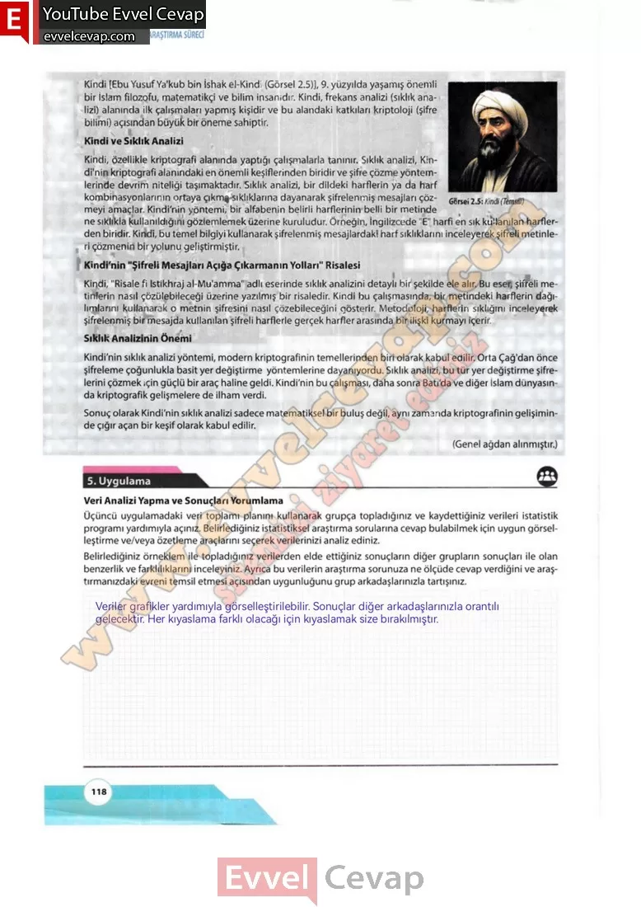

## 10. Sınıf Matematik Ders Kitabı Cevapları Meb Yayınları Sayfa 118

Kindi [Ebu Yusuf Ya’kub bin İshak el-Kindi (Görsel 2.5)], 9. yüzyılda yaşamış önemli bir İslam filozofu, matematikçi ve bilim insanıdır. Kindi, frekans analizi (sıklık analizi) alanında ilk çalışmaları yapmış kişidir ve bu alandaki katkıları kriptoloji (şifre bilimi) açısından büyük bir öneme sahiptir.  
 Kindi ve Sıklık Analizi  
 Kindi, özellikle kriptografi alanında yaptığı çalışmalarla tanınır. Sıklık analizi, Kin- di’nin kriptografi alanındaki en önemli keşiflerinden biridir ve şifre çözme yöntemlerinde devrim niteliği taşımaktadır. Sıklık analizi, bir dildeki harflerin ya da harf kombinasyonlarının ortaya çıkma sıklıklarına dayanarak şifrelenmiş mesajları çözmeyi amaçlar. Kindi’nin yöntemi, bir alfabenin belirli harflerinin belli bir metinde ne sıklıkla kullanıldığını gözlemlemek üzerine kuruludur. Örneğin, İngilizcede “E” harfi en sık kullanılan harflerden biridir. Kindi, bu temel bilgiyi kullanarak şifrelenmiş mesajlardaki harf sıklıklarını inceleyerek şifreli metinleri çözmenin bir yolunu geliştirmiştir.  
 Kindi’nin “Şifreli Mesajları Açığa Çıkarmanın Yollan” Risalesi  
 Kindi, “Risale fi Istikhraj al-Mu’amma” adlı eserinde sıklık analizini detaylı bir şekilde ele alır. Bu eser, şifreli metinlerin nasıl çözülebileceği üzerine yazılmış bir risaledir. Kindi bu çalışmasında, bir metindeki harflerin dağılımlarını kullanarak o metnin şifresini nasıl çözebileceğini gösterir. Metodoloji, harflerin sıklığını inceleyerek şifrelenmiş bir mesajda kullanılan şifreli harflerle gerçek harfler arasında bir ilişki kurmayı içerir.  
 Sıklık Analizinin Önemi  
 Kindi’nin sıklık analizi yöntemi, modern kriptografinirı temellerinden biri olarak kabul edilir. Orta Çağ’dan önce şifreleme çoğunlukla basit yer değiştirme yöntemlerine dayanıyordu. Sıklık analizi, bu tür yer değiştirme şifrelerini çözmek için güçlü bir araç haline geldi. Kindi’nin bu çalışması, daha sonra Batı’da ve diğer İslam dünyasında kriptografik gelişmelere de ilham verdi.  
 Sonuç olarak Kindi’nin sıklık analizi sadece matematiksel bir buluş değil, aynı zamanda kriptografinin gelişiminde çığır açan bir keşif olarak kabul edilir.

**Uygulama**

**Veri Analizi Yapma ve Sonuçları Yorumlama**

Üçüncü uygulamadaki veri toplamı planını kullanarak grupça topladığınız ve kaydettiğiniz verileri istatistik programı yardımıyla açınız. Belirlediğiniz istatistiksel araştırma sorularına cevap bulabilmek için uygun görselleştirme ve/veya özetleme araçlarını seçerek verilerinizi analiz ediniz.

**Soru: Belirlediğiniz örneklem ile topladığınız verilerden elde ettiğiniz sonuçların diğer grupların sonuçları ile olan benzerlik ve farklılıklarını inceleyiniz. Ayrıca bu verilerin araştırma sorunuza ne ölçüde cevap verdiğini ve araştırmanızdaki evreni temsil etmesi açısından uygunluğunu grup arkadaşlarınızla tartışınız.**

**10. Sınıf Meb Yayınları Matematik Ders Kitabı Sayfa 118**