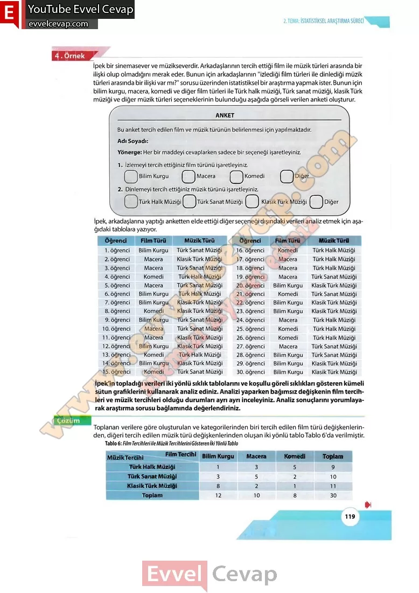

## 10. Sınıf Matematik Ders Kitabı Cevapları Meb Yayınları Sayfa 119

İpek bir sinemasever ve müzikseverdir. Arkadaşlarının tercih ettiği film ile müzik türleri arasında bir ilişki olup olmadığını merak eder. Bunun için arkadaşlarının “izlediği film türleri ile dinlediği müzik türleri arasında bir ilişki var mı?” sorusu üzerinden istatistiksel bir araştırma yapmak ister. Bunun için bilim kurgu, macera, komedi ve diğer film türleri ileTürk halk müziği,Türk sanat müziği, klasikTürk müziği ve diğer müzik türleri seçeneklerinin bulunduğu aşağıda görseli verilen anketi oluşturur.

İpek’in topladığı verileri iki yönlü sıklık tablolarını ve koşullu göreli sıklıkları gösteren kümeli sütun grafiklerini kullanarak analiz ediniz. Analizi yaparken bağımsız değişkenin film tercihleri ve müzik tercihleri olduğu durumları ayrı ayrı inceleyiniz. Analiz sonuçlarını yorumlayarak araştırma sorusu bağlamında değerlendirin

Toplanan verilere göre oluşturulan ve kategorilerinden biri tercih edilen film türü değişkenlerinden, diğeri tercih edilen müziktürü değişkenlerinden oluşan iki yönlü tabloTablo 6’da verilmiştir.

* **Cevap**: **Bu sayfada soru bulunmamaktadır.**

**10. Sınıf Meb Yayınları Matematik Ders Kitabı Sayfa 119**