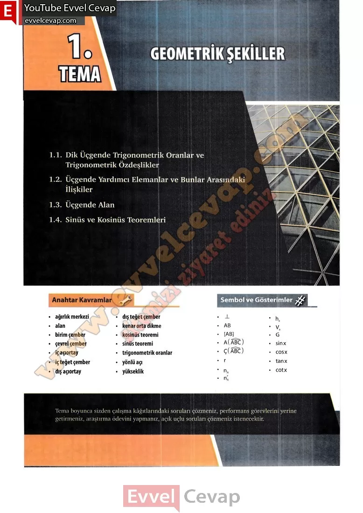

## 10. Sınıf Matematik Ders Kitabı Cevapları Meb Yayınları Sayfa 12

Yapı tasarımı ve inşasında, her türlü perspektif çiziminde, yön bulma cihazlarında veya haritalarda iki nokta arasındaki mesafenin belirlenmesinde, uçaklar ile gemilerin yön bulma ve doğru rota oluşturmalarında, güneş ışınlarının geliş açısıyla bir nesnenin gölgesinin uzunluğu arasındaki ilişkiyi anlama gibi birçok alanda üçgen, üçgenin yardımcı elemanları ve trigonometrik oranlar kullanılır. Bu konuların anlaşılması, çeşitli alanlardaki hesaplamaların ve tasarımların daha doğru ve verimli yapılmasına yardımcı olur.

* **Cevap**: **Bu sayfada soru bulunmamaktadır.**

**10. Sınıf Meb Yayınları Matematik Ders Kitabı Sayfa 12**