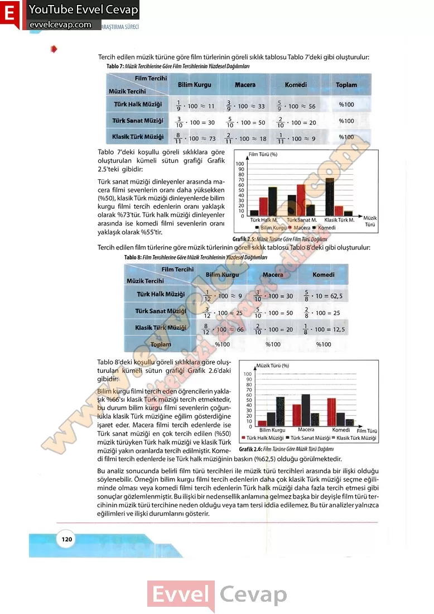

## 10. Sınıf Matematik Ders Kitabı Cevapları Meb Yayınları Sayfa 120

Tercih edilen müzik türüne göre film türlerinin göreli sıklık tablosu Tablo 7’deki gibi oluşturulur:

Tablo 7’deki koşullu göreli sıklıklara göre oluşturulan kümeli sütun grafiği Grafik 2.5’teki gibidir:  
 Türk sanat müziği dinleyenler arasında macera filmi sevenlerin oranı daha yüksekken (%50), klasikTürk müziği dinleyenlerde bilim kurgu filmi tercih edenlerin oranı yaklaşık olarak %73’tür. Türk halk müziği dinleyenler arasında ise komedi filmi sevenlerin oranı yaklaşık olarak %55’tir.

Tablo 8’deki koşullu göreli sıklıklara göre oluşturulan kümeli sütun grafiği Grafik 2.6’daki gibidir:  
 Bilim kurgu filmi tercih eden öğrencilerin yaklaşık %66’sı klasikTürk müziği tercih etmektedir, bu durum bilim kurgu filmi sevenlerin çoğunlukla klasikTürk müziğine eğilim gösterdiğine işaret eder. Macera filmi tercih edenlerde ise Türk sanat müziği en çok tercih edilen (%50) müzik türüyken Türk halk müziği ve klasikTürk müziği yakın oranlarda tercih edilmiştir. Komedi filmi tercih edenlerde ise Türk halk müziğinin baskın (%62,5) olduğu görülmektedir.  
 Bu analiz sonucunda belirli film türü tercihleri ile müzik türü tercihleri arasında bir ilişki olduğu söylenebilir. Örneğin bilim kurgu filmi tercih edenlerin daha çok klasikTürk müziği seçme eğiliminde olması veya komedi filmi tercih edenlerin Türk halk müziği daha fazla tercih etmesi gibi sonuçlar gözlemlenmiştir. Bu ilişki bir nedensellik anlamına gelmez başka bir deyişle film türü tercihinin müzik türü tercihine neden olduğu veya tam tersi iddia edilemez. Bu tür analizler yalnızca eğilimleri ve ilişki durumlarını gösterir.

* **Cevap**: **Bu sayfada soru bulunmamaktadır.**

**10. Sınıf Meb Yayınları Matematik Ders Kitabı Sayfa 120**