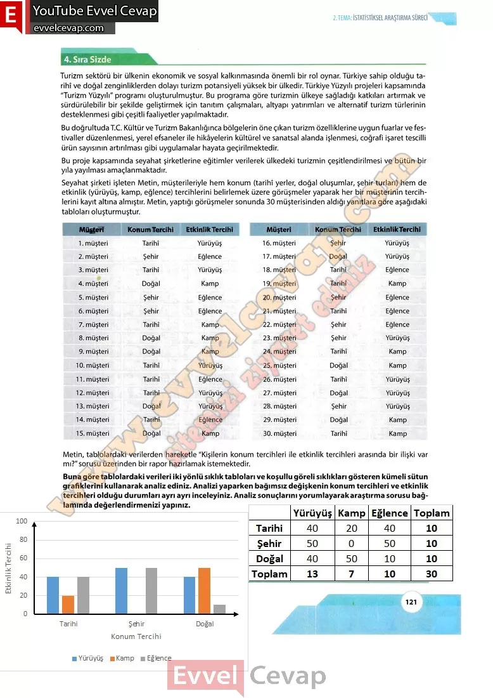

## 10. Sınıf Matematik Ders Kitabı Cevapları Meb Yayınları Sayfa 121

**4. Sıra Sizde**

Turizm sektörü bir ülkenin ekonomik ve sosyal kalkınmasında önemli bir rol oynar. Türkiye sahip olduğu tarihî ve doğal zenginliklerden dolayı turizm potansiyeli yüksek bir ülkedir. Türkiye Yüzyılı projeleri kapsamında “Turizm Yüzyılı” programı oluşturulmuştur. Bu programa göre turizmin ülkeye sağladığı katkıları artırmak ve sürdürülebilir bir şekilde geliştirmek için tanıtım çalışmaları, altyapı yatırımları ve alternatif turizm türlerinin desteklenmesi gibi çeşitli faaliyetler yapılmaktadır.  
 Bu doğrultuda T.C. Kültür ve Turizm Bakanlığınca bölgelerin öne çıkan turizm özelliklerine uygun fuarlar ve festivaller düzenlenmesi, yerel efsaneler ile hikâyelerin kültürel ve sanatsal alanda işlenmesi, coğrafi işaret tescilli ürün sayısının artırılması gibi uygulamalar hayata geçirilmektedir.  
 Bu proje kapsamında seyahat şirketlerine eğitimler verilerek ülkedeki turizmin çeşitlendirilmesi ve bütün bir yıla yayılması amaçlanmaktadır.  
 Seyahat şirketi işleten Metin, müşterileriyle hem konum (tarihî yerler, doğal oluşumlar, şehir turları) hem de etkinlik (yürüyüş, kamp, eğlence) tercihlerini belirlemek üzere görüşmeler yaparak her bir müşterinin tercihlerini kayıt altına almıştır. Metin, yaptığı görüşmeler sonunda 30 müşterisinden aldığı yanıtlara göre aşağıdaki tabloları oluşturmuştur.  
 Metin, tablolardaki verilerden hareketle “Kişilerin konum tercihleri ile etkinlik tercihleri arasında bir ilişki var mı?”sorusu üzerinden bir rapor hazırlamak istemektedir.

**Soru: Buna göre tablolardaki verileri iki yönlü sıklık tabloları ve koşullu göreli sıklıkları gösteren kümeli sütun grafiklerini kullanarak analiz ediniz. Analizi yaparken bağımsız değişkenin konum tercihleri ve etkinlik tercihleri olduğu durumları ayrı ayrı inceleyiniz. Analiz sonuçlarını yorumlayarak araştırma sorusu bağlamında değerlendirmenizi yapınız.**

**10. Sınıf Meb Yayınları Matematik Ders Kitabı Sayfa 121**