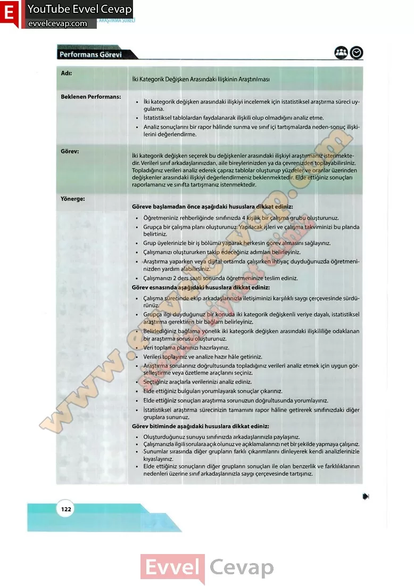

## 10. Sınıf Matematik Ders Kitabı Cevapları Meb Yayınları Sayfa 122

**Performans Görevi**

Adı: İki Kategorik Değişken Arasındaki İlişkinin Araştırılması  
 Beklenen Performans:  
 • İki kategorik değişken arasındaki ilişkiyi incelemek için istatistiksel araştırma süreci uygulama.  
 • İstatistiksel tablolardan faydalanarak ilişkili olup olmadığını analiz etme.  
 • Analiz sonuçlarını bir rapor hâlinde sunma ve sınıf içi tartışmalarda neden-sonuç ilişkilerini değerlendirme.  
 Görev İki kategorik değişken seçerek bu değişkenler arasındaki ilişkiyi araştırmanız istenmektedir. Verileri sınıf arkadaşlarınızdan, aile bireylerinizden ya da çevrenizden toplayabilirsiniz. Topladığınız verileri analiz ederek çapraz tablolar oluşturup yüzdeler ve oranlar üzerinden değişkenler arasındaki ilişkiyi değerlendirmeniz beklenmektedir. Elde ettiğiniz sonuçları raporlamanız ve sınıfta tartışmanız istenmektedir.

**Yönerge:**

Göreve başlamadan önce aşağıdaki hususlara dikkat ediniz:  
 • Öğretmeniniz rehberliğinde sınıfınızda 4 kişilik bir çalışma grubu oluşturunuz.  
 • Grupça bir çalışma planı oluşturunuz. Yapılacak işleri ve çalışma takviminizi bu planda belirtiniz.  
 • Grup üyelerinizle bir iş bölümü yaparak herkesin görev almasını sağlayınız.  
 • Çalışmanızı oluştururken takip edeceğiniz adımları belirleyiniz.  
 • Araştırma yaparken veya dijital ortamda çalışırken ihtiyaç duyduğunuzda öğretmeninizden yardım alabilirsiniz.  
 • Çalışmanızı 2 ders saati sonunda öğretmeninize teslim ediniz.  
 Görev esnasında aşağıdaki hususlara dikkat ediniz:  
 • Çalışma sürecinde ekip arkadaşlarınızla iletişiminizi karşılıklı saygı çerçevesinde sürdürünüz.  
 • Grupça ilgi duyduğunuz bir konuda iki kategorik değişkenli veriye dayalı, istatistiksel araştırma gerektiren bir bağlam belirleyiniz.  
 • Belirlediğiniz bağlama yönelik iki kategorik değişken arasındaki ilişkililiğe odaklanan bir araştırma sorusu oluşturunuz.  
 • Veri toplama planınızı hazırlayınız.  
 • Verileri toplayınız ve analize hazır hâle getiriniz.  
 • Araştırma sorularınız doğrultusunda topladığınız verileri analiz etmek için uygun görselleştirme veya özetleme araçlarını seçiniz.  
 • Seçtiğiniz araçlarla verilerinizi analiz ediniz.  
 • Elde ettiğiniz bulguları yorumlayarak sonuçlar çıkarınız.  
 • Elde ettiğiniz sonuçları araştırma sorunuzun doğrultusunda yorumlayınız.  
 • İstatistiksel araştırma sürecinizin tamamını rapor hâline getirerek sınıfınızdaki diğer gruplara sununuz.

Görev bitiminde aşağıdaki hususlara dikkat ediniz:

**Soru: Oluşturduğunuz sunuyu sınıfınızda arkadaşlarınızla paylaşınız.**

**Soru: Çalışmanızla ilgili sorulara açık olunuz ve açıklamalarınızı net bir şekilde yapmaya çalışınız.**

**Soru: Sunumlar sırasında diğer grupların farklı çıkarımlarını dinleyerek kendi analizlerinizle kıyaslayınız.**

**Soru: Elde ettiğiniz sonuçların diğer grupların sonuçları ile olan benzerlik ve farklılıklarının nedenleri üzerine sınıf arkadaşlarınızla saygı çerçevesinde tartışınız.**

**10. Sınıf Meb Yayınları Matematik Ders Kitabı Sayfa 122**