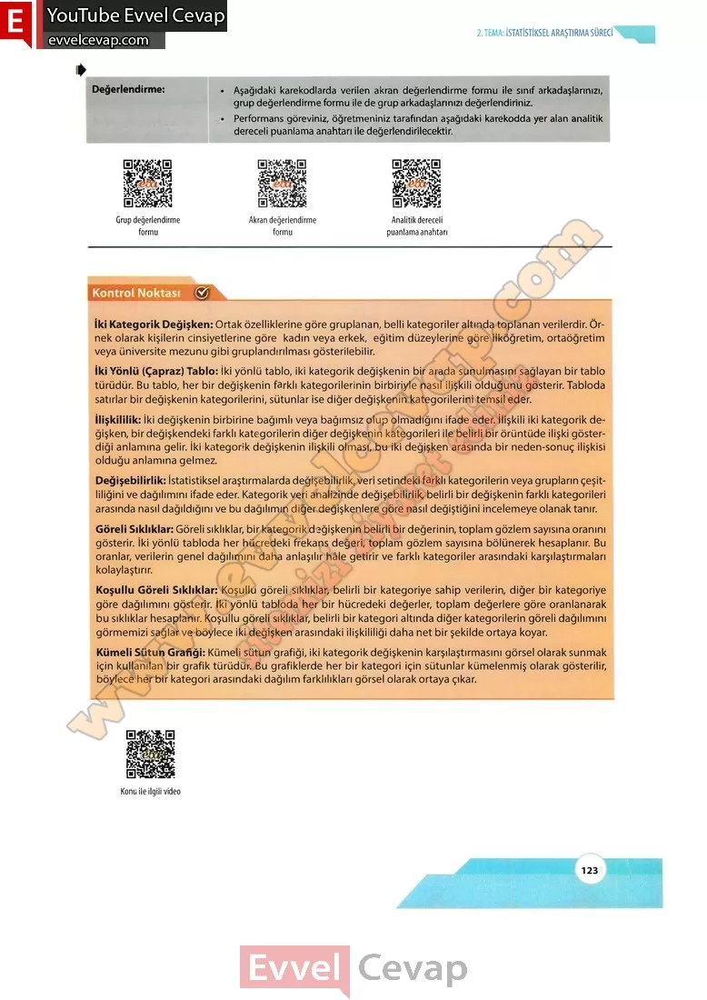

## 10. Sınıf Matematik Ders Kitabı Cevapları Meb Yayınları Sayfa 123

**Değerlendirme:**

**Soru: Aşağıdaki karekodlarda verilen akran değerlendirme formu ile sınıf arkadaşlarınızı, grup değerlendirme formu ile de grup arkadaşlarınızı değerlendiriniz.**

**Soru: Performans göreviniz, öğretmeniniz tarafından aşağıdaki karekodda yer alan analitik dereceli puanlama anahtarı ile değerlendirilecektir.**

İki Kategorik Değişken: Ortak özelliklerine göre gruplanan, belli kategoriler altında toplanan verilerdir. Örnek olarak kişilerin cinsiyetlerine göre kadın veya erkek, eğitim düzeylerine göre ilköğretim, ortaöğretim veya üniversite mezunu gibi gruplandırılması gösterilebilir.  
 İki Yönlü (Çapraz) Tablo: İki yönlü tablo, iki kategorik değişkenin bir arada sunulmasını sağlayan bir tablo türüdür. Bu tablo, her bir değişkenin farklı kategorilerinin birbiriyle nasıl ilişkili olduğunu gösterir. Tabloda satırlar bir değişkenin kategorilerini, sütunlar ise diğer değişkenin kategorilerini temsil eder.  
 İlişkililik: İki değişkenin birbirine bağımlı veya bağımsız olup olmadığını ifade eder. İlişkili iki kategorik değişken, bir değişkendeki farklı kategorilerin diğer değişkenin kategorileri ile belirli bir örüntüde ilişki gösterdiği anlamına gelir. İki kategorik değişkenin ilişkili olması, bu iki değişken arasında bir neden-sonuç ilişkisi olduğu anlamına gelmez.  
 Değişebilirlik: İstatistiksel araştırmalarda değişebilirlik, veri setindeki farklı kategorilerin veya grupların çeşitliliğini ve dağılımını ifade eder. Kategorik veri analizinde değişebilirlik, belirli bir değişkenin farklı kategorileri arasında nasıl dağıldığını ve bu dağılımın diğer değişkenlere göre nasıl değiştiğini incelemeye olanak tanır.  
 Göreli Sıklıklar: Göreli sıklıklar, bir kategorik değişkenin belirli bir değerinin, toplam gözlem sayısına oranını gösterir. İki yönlü tabloda her hücredeki frekans değeri, toplam gözlem sayısına bölünerek hesaplanır. Bu oranlar, verilerin genel dağılımını daha anlaşılır hâle getirir ve farklı kategoriler arasındaki karşılaştırmaları kolaylaştırır.  
 Koşullu Göreli Sıklıklar: Koşullu göreli sıklıklar, belirli bir kategoriye sahip verilerin, diğer bir kategoriye göre dağılımını gösterir. İki yönlü tabloda her bir hücredeki değerler, toplam değerlere göre oranlanarak bu sıklıklar hesaplanır. Koşullu göreli sıklıklar, belirli bir kategori altında diğer kategorilerin göreli dağılımını görmemizi sağlar ve böylece iki değişken arasındaki ilişkililiği daha net bir şekilde ortaya koyar.  
 Kümeli Sütun Grafiği: Kümeli sütun grafiği, iki kategorik değişkenin karşılaştırmasını görsel olarak sunmak için kullanılan bir grafik türüdür. Bu grafiklerde her bir kategori için sütunlar kümelenmiş olarak gösterilir, böylece her bir kategori arasındaki dağılım farklılıkları görsel olarak ortaya çıkar.

**10. Sınıf Meb Yayınları Matematik Ders Kitabı Sayfa 123**