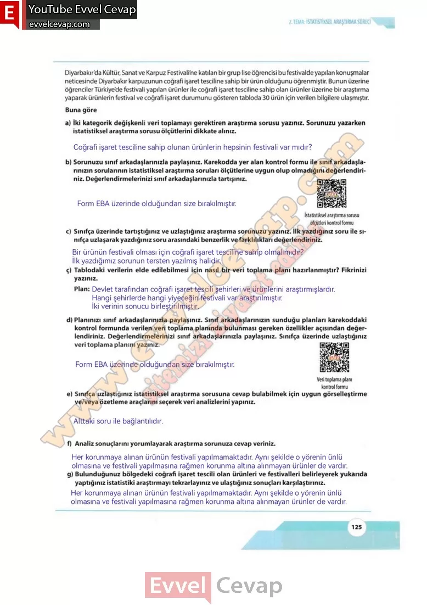

## 10. Sınıf Matematik Ders Kitabı Cevapları Meb Yayınları Sayfa 125

Diyarbakır’da Kültür, Sanat ve Karpuz Festivali’ne katılan bir grup lise öğrencisi bu festivalde yapılan konuşmalar neticesinde Diyarbakır karpuzunun coğrafi işaret tesciline sahip bir ürün olduğunu öğrenmiştir. Bunun üzerine öğrenciler Türkiye’de festivali yapılan ürünler ile coğrafi işaret tesciline sahip olan ürünler üzerine bir araştırma yaparak ürünlerin festival ve coğrafi işaret durumunu gösteren tabloda 30 ürün için verilen bilgilere ulaşmıştır. Buna göre

**Soru: a) İki kategorik değişkenli veri toplamayı gerektiren araştırma sorusu yazınız. Sorunuzu yazarken istatistiksel araştırma sorusu ölçütlerini dikkate alınız.**

**Soru: b) Sorunuzu sınıf arkadaşlarınızla paylaşınız. Karekodda yer alan kontrol formu ile sınıf arkadaşlarınızın sorularının istatistiksel araştırma soruları ölçütlerine uygun olup olmadığını değerlendiriniz. Değerlendirmelerinizi sınıf arkadaşlarınızla tartışınız.**

**Soru: c) Sınıfça üzerinde tartıştığınız ve uzlaştığınız araştırma sorunuzu yazınız. İlk yazdığınız soru ile sınıfça uzlaşarak yazdığınız soru arasındaki benzerlik ve farklılıkları değerlendiriniz.**

**Soru: ç) Tablodaki verilerin elde edilebilmesi için nasıl bir veri toplama planı hazırlanmıştır? Fikrinizi yazınız.**

**Soru: d) Planınızı sınıf arkadaşlarınızla paylaşınız. Sınıf arkadaşlarınızın sunduğu planları karekoddaki kontrol formunda verilen veri toplama planında bulunması gereken özellikler açısından değerlendiriniz. Değerlendirmelerinizi sınıf arkadaşlarınızla paylaşınız. Sınıfça üzerinde uzlaştığınız veri toplama planını yazınız.**

**Soru: e) Sınıfça uzlaştığınız istatistiksel araştırma sorusuna cevap bulabilmek için uygun görselleştirme ve/veya özetleme araçlarını seçerek veri analizlerini yapınız.**

**Soru: f) Analiz sonuçlarını yorumlayarak araştırma sorunuza cevap veriniz.**

**Soru: g) Bulunduğunuz bölgedeki coğrafi işaret tescili olan ürünleri ve festivalleri belirleyerek yukarıda yaptığınız istatistiki araştırmayı tekrarlayınız ve ulaştığınız sonuçları karşılaştırınız.**

**10. Sınıf Meb Yayınları Matematik Ders Kitabı Sayfa 125**