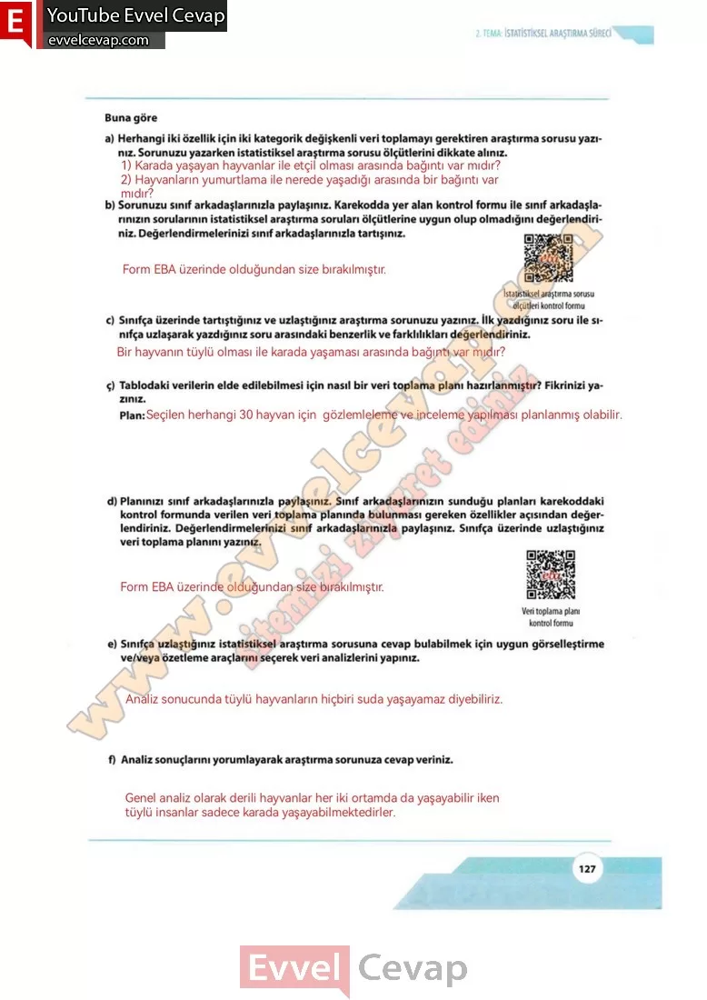

## 10. Sınıf Matematik Ders Kitabı Cevapları Meb Yayınları Sayfa 127

**Soru: a) Herhangi iki özellik için iki kategorik değişkenli veri toplamayı gerektiren araştırma sorusu yazınız. Sorunuzu yazarken istatistiksel araştırma sorusu ölçütlerini dikkate alınız.**

**Soru: b) Sorunuzu sınıf arkadaşlarınızla paylaşınız. Karekodda yer alan kontrol formu ile sınıf arkadaşlarınızın sorularının istatistiksel araştırma soruları ölçütlerine uygun olup olmadığını değerlendirniz. Değerlendirmelerinizi sınıf arkadaşlarınızla tartışınız.**

**Soru: c) Sınıfça üzerinde tartıştığınız ve uzlaştığınız araştırma sorunuzu yazınız. İlk yazdığınız soru ile sınıfça uzlaşarak yazdığınız soru arasındaki benzerlik ve farklılıkları değerlendiriniz.**

**Soru: ç) Tablodaki verilerin elde edilebilmesi için nasıl bir veri toplama planı hazırlanmıştır? Fikrinizi yazınız.**

**Soru: d) Planınızı sınıf arkadaşlarınızla paylaşınız. Sınıf arkadaşlarınızın sunduğu planları karekoddaki kontrol formunda verilen veri toplama planında bulunması gereken özellikler açısından değerlendiriniz. Değerlendirmelerinizi sınıf arkadaşlarınızla paylaşınız. Sınıfça üzerinde uzlaştığınız veri toplama planını yazınız.**

**Soru: e) Sınıfça uzlaştığınız istatistiksel araştırma sorusuna cevap bulabilmek için uygun görselleştirme ve/veya özetleme araçlarını seçerek veri analizlerini yapınız.**

**Soru: f) Analiz sonuçlarını yorumlayarak araştırma sorunuza cevap veriniz.**

**10. Sınıf Meb Yayınları Matematik Ders Kitabı Sayfa 127**