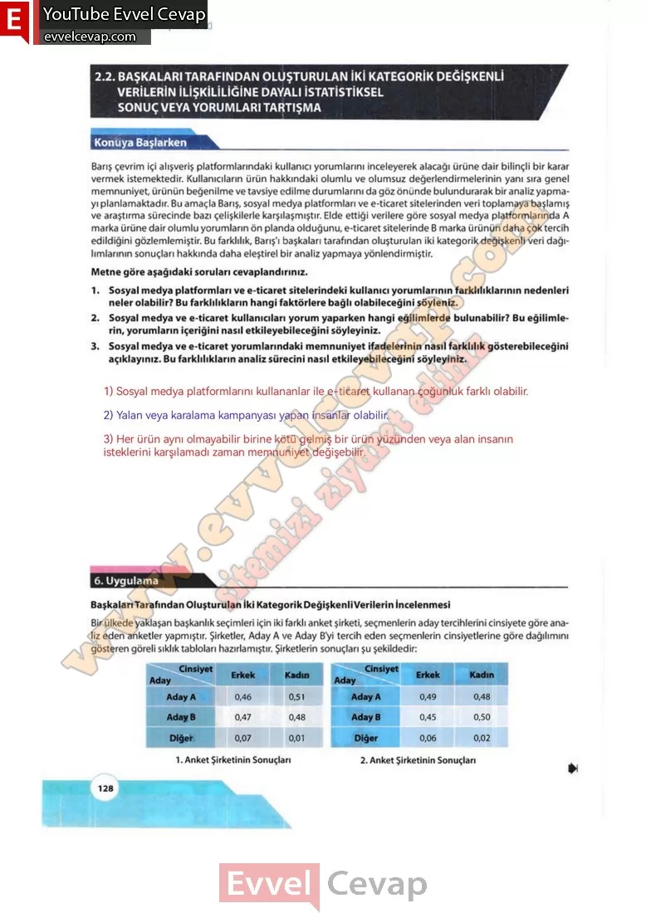
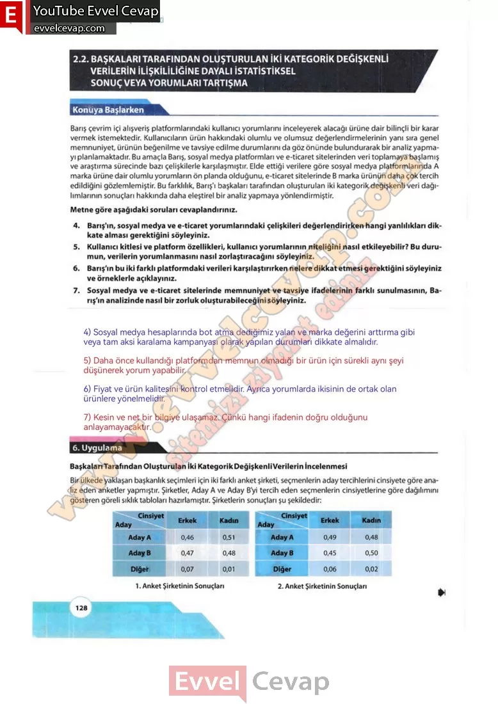

## 10. Sınıf Matematik Ders Kitabı Cevapları Meb Yayınları Sayfa 128

**Konuya Başlarken**

Barış çevrim içi alışveriş platformlarındaki kullanıcı yorumlarını inceleyerek alacağı ürüne dair bilinçli bir karar vermek istemektedir. Kullanıcıların ürün hakkındaki olumlu ve olumsuz değerlendirmelerinin yanı sıra genel memnuniyet ürünün beğenilme ve tavsiye edilme durumlarını da göz önünde bulundurarak bir analiz yapmayı planlamaktadır. Bu amaçla Barış, sosyal medya platformları ve e-ticaret sitelerinden veri toplamaya başlamış ve araştırma sürecinde bazı çelişkilerle karşılaşmıştır. Elde ettiği verilere göre sosyal medya platformlarında A marka ürüne dair olumlu yorumların ön planda olduğunu, e-ticaret sitelerinde B marka ürünün daha çok tercih edildiğini gözlemlemiştir. Bu farklılık, Barış’ı başkaları tarafından oluşturulan iki kategorik değişkenli veri dağılımlarının sonuçları hakkında daha eleştirel bir analiz yapmaya yönlendirmiştir.

**Soru: Metne göre aşağıdaki soruları cevaplandırınız.**

**Soru: 1) Sosyal medya platformları ve e-ticaret sitelerindeki kullanıcı yorumlarının farklılıklarının nedenleri neler olabilir? Bu farklılıkların hangi faktörlere bağlı olabileceğini söyleniz.**

**Soru: 2) Sosyal medya ve e-ticaret kullanıcıları yorum yaparken hangi eğilimlerde bulunabilir? Bu eğilimlerin, yorumların içeriğini nasıl etkileyebileceğini söyleyiniz.**

**Soru: 3) Sosyal medya ve e-ticaret yorumlarındaki memnuniyet ifadelerinin nasıl farklılık gösterebileceğini açıklayınız. Bu farklılıkların analiz sürecini nasıl etkileyebileceğini söyleyiniz.**

**Soru: 4) Barış’ın, sosyal medya ve e-ticaret yorumlarındaki çelişkileri değerlendirirken hangi yanlılıkları dikkate alması gerektiğini söyleyiniz.**

**Soru: 5) Kullanıcı kitlesi ve platform özellikleri, kullanıcı yorumlarının niteliğini nasıl etkileyebilir? Bu durumun, verilerin yorumlanmasını nasıl zorlaştıracağını söyleyiniz.**

**Soru: 6) Barış’ın bu iki farklı platformdaki verileri karşılaştırırken nelere dikkat etmesi gerektiğini söyleyiniz ve örneklerle açıklayınız.**

**Soru: 7) Sosyal medya ve e-ticaret sitelerinde memnuniyet ve tavsiye ifadelerinin farklı sunulmasının, Barış’ın analizinde nasıl bir zorluk oluşturabileceğini söyleyiniz.**

İki kategorik değişkenli verilerin analizi, istatistiksel çalışmaların önemli bir kısmını oluşturur. Bu tür verilerle yapılan analizler, belirli kategoriler arasındaki ilişkileri anlamak için kullanılır. Başkaları tarafından oluşturulan veri dağılımlarına dayalı sonuç veya yorumlar, doğru bir şekilde değerlendirilmezse yanlış yönlendirmelere neden olabilir. Bu nedenle bu tür analizlere eleştirel bir gözle bakmak ve yapılan yorumların geçerliliğini sorgulamak büyük önem taşır.

**6. Uygulama**

**Başkaları Tarafından Oluşturulan İki Kategorik Değişkenli Verilerin İncelenmesi**

Bir ülkede yaklaşan başkanlık seçimleri için iki farklı anket şirketi, seçmenlerin aday tercihlerini cinsiyete göre analiz eden anketler yapmıştır. Şirketler, Aday A ve Aday B’yi tercih eden seçmenlerin cinsiyetlerine göre dağılımını gösteren göreli sıklık tabloları hazırlamıştır. Şirketlerin sonuçları şu şekildedir:

  
 

**10. Sınıf Meb Yayınları Matematik Ders Kitabı Sayfa 128**