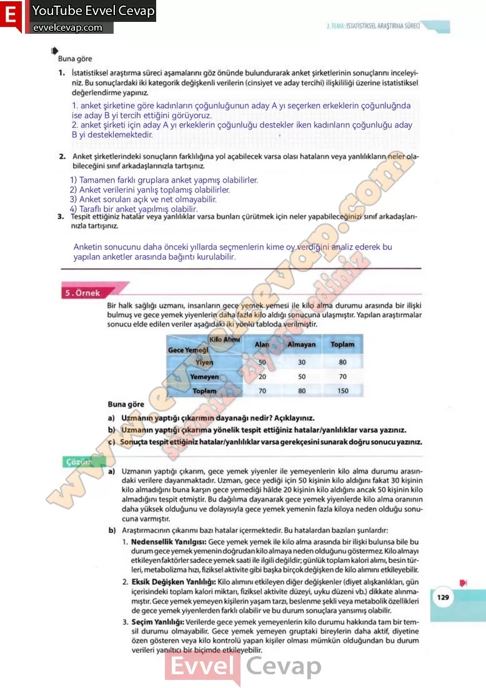

## 10. Sınıf Matematik Ders Kitabı Cevapları Meb Yayınları Sayfa 129

**Soru: 1) İstatistiksel araştırma süreci aşamalarını göz önünde bulundurarak anket şirketlerinin sonuçlarını inceleyiniz. Bu sonuçlardaki iki kategorik değişkenli verilerin (cinsiyet ve aday tercihi) ilişkililiği üzerine istatistiksel değerlendirme yapınız.**

**Soru: 2) Anket şirketlerindeki sonuçların farklılığına yol açabilecek varsa olası hataların veya yanlılıkların neler olabileceğini sınıf arkadaşlarınızla tartışınız.**

**Soru: 3) Tespit ettiğiniz hatalar veya yanlılıklar varsa bunları çürütmek için neler yapabileceğinizi sınıf arkadaşlarınızla tartışınız.**

Bir halk sağlığı uzmanı, insanların gece yemek yemesi ile kilo alma durumu arasında bir ilişki bulmuş ve gece yemek yiyenlerin daha fazla kilo aldığı sonucuna ulaşmıştır. Yapılan araştırmalar sonucu elde edilen veriler aşağıdaki iki yönlü tabloda verilmiştir.  
 Buna göre  
 a) Uzmanın yaptığı çıkarımın dayanağı nedir? Açıklayınız.  
 b) Uzmanın yaptığı çıkarıma yönelik tespit ettiğiniz hatalar/yanlılıklar varsa yazınız.  
 c) Sonuçta tespit ettiğiniz hatalar/yanlılıklar varsa gerekçesini sunarak doğru sonucu yazınız.

a) Uzmanın yaptığı çıkarım, gece yemek yiyenler ile yemeyenlerin kilo alma durumu arasındaki verilere dayanmaktadır. Uzman, gece yediği için 50 kişinin kilo aldığını fakat 30 kişinin kilo almadığını buna karşın gece yemediği hâlde 20 kişinin kilo aldığını ancak 50 kişinin kilo almadığını tespit etmiştir. Bu dağılıma dayanarak gece yemek yiyenlerde kilo alma oranının daha yüksek olduğunu ve dolayısıyla gece yemek yemenin fazla kiloya neden olduğu sonucuna varmıştır.  
 b) Araştırmacının çıkarımı bazı hatalar içermektedir. Bu hatalardan bazıları şunlardır:  
 1. Nedensellik Yanılgısı: Gece yemek yemek ile kilo alma arasında bir ilişki bulunsa bile bu durum gece yemekyemenin doğrudan kilo almaya neden olduğunu göstermez. Kilo almayı etkileyen faktörler sadece yemek saati ile ilgili değildir; günlük toplam kalori alımı, besin türleri, metabolizma hızı, fiziksel aktivite gibi başka birçok değişken de kilo alimim etkileyebilir.  
 2. Eksik Değişken Yanlılığı: Kilo alimim etkileyen diğer değişkenler (diyet alışkanlıkları, gün içerisindeki toplam kalori miktarı, fiziksel aktivite düzeyi, uyku düzeni vb.) dikkate alınmamıştır. Gece yemek yemeyen kişilerin yaşam tarzı, beslenme şekli veya metabolik özellikleri de gece yemek yiyenlerden farklı olabilir ve bu durum sonuçlara yansımış olabilir.  
 3. Seçim Yanlılığı: Verilerde gece yemek yemeyenlerin kilo durumu hakkında tam bir temsil durumu olmayabilir. Gece yemek yemeyen gruptaki bireylerin daha aktif, diyetine özen gösteren veya kilo kontrolü yapan kişiler olması mümkün olduğundan bu durum verileri yanıltıcı bir biçimde etkileyebilir.

**10. Sınıf Meb Yayınları Matematik Ders Kitabı Sayfa 129**