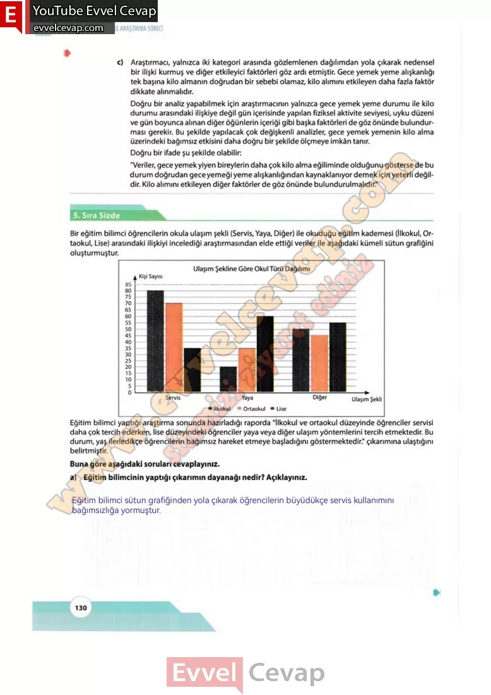

## 10. Sınıf Matematik Ders Kitabı Cevapları Meb Yayınları Sayfa 130

c) Araştırmacı, yalnızca iki kategori arasında gözlemlenen dağılımdan yola çıkarak nedensel bir ilişki kurmuş ve diğer etkileyici faktörleri göz ardı etmiştir. Gece yemek yeme alışkanlığı tek başına kilo almanın doğrudan bir sebebi olamaz, kilo alimim etkileyen daha fazla faktör dikkate alınmalıdır.  
 Doğru bir analiz yapabilmek için araştırmacının yalnızca gece yemek yeme durumu ile kilo durumu arasındaki ilişkiye değil gün içerisinde yapılan fiziksel aktivite seviyesi, uyku düzeni ve gün boyunca alman diğer öğünlerin içeriği gibi başka faktörleri de göz önünde bulundurması gerekir. Bu şekilde yapılacak çok değişkenli analizler, gece yemek yemenin kilo alma üzerindeki bağımsız etkisini daha doğru bir şekilde ölçmeye imkân tanır.  
 Doğru bir ifade şu şekilde olabilir:  
 “Veriler, gece yemek yiyen bireylerin daha çok kilo alma eğiliminde olduğunu gösterse de bu durum doğrudan gece yemeği yeme alışkanlığından kaynaklanıyor demek için yeterli değildir. Kilo alimim etkileyen diğer faktörler de göz önünde bulundurulmalıdır.”

**Sıra Sizde**

**Soru:** Bir eğitim bilimci öğrencilerin okula ulaşım şekli (Servis, Yaya, Diğer) ile okuduğu eğitim kademesi (İlkokul, Ortaokul, Lise) arasındaki ilişkiyi incelediği araştırmasından elde ettiği veriler ile aşağıdaki kümeli sütun grafiğini oluşturmuştur. Eğitim bilimci yaptığı araştırma sonunda hazırladığı raporda “İlkokul ve ortaokul düzeyinde öğrenciler servisi daha çok tercih ederken, lise düzeyindeki öğrenciler yaya veya diğer ulaşım yöntemlerini tercih etmektedir. Bu durum, yaş ilerledikçe öğrencilerin bağımsız hareket etmeye başladığını göstermektedir.” çıkarımına ulaştığım belirtmiştir**. Buna göre aşağıdaki sorulara cevaplayınız.**

**Soru: a) Eğitim bilimcinin yaptığı çıkarınım dayanağı nedir? Açıklayınız»**

**10. Sınıf Meb Yayınları Matematik Ders Kitabı Sayfa 130**