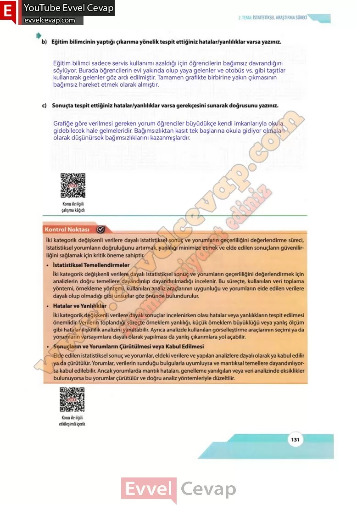

## 10. Sınıf Matematik Ders Kitabı Cevapları Meb Yayınları Sayfa 131

**Soru: b) Eğitim bilimcinin yaptığı çıkarıma yönelik tespit ettiğiniz hatalar/yanlılıklar varsa yazınız.**

**Soru: c) Sonuçta tespit ettiğiniz hatalar/yanlılıklar varsa gerekçesini sunarak doğrusunu yazınız.**

İki kategorik değişkenli verilere dayalı istatistiksel sonuç ve yorumların geçerliliğini değerlendirme süreci, istatistiksel yorumların doğruluğunu artırmak, yanlılığı minimize etmek ve elde edilen sonuçların güvenilirliğini sağlamak için kritik öneme sahiptir.  
 • İstatistiksel Temellendirmeler  
 İki kategorik değişkenli verilere dayalı istatistiksel sonuç ve yorumların geçerliliğini değerlendirmek için analizlerin doğru temellere dayandırılıp dayandırmadığı incelenir. Bu süreçte, kullanılan veri toplama yöntemi, örnekleme yöntemi, kullanılan analiz araçlarının uygunluğu ve yorumların elde edilen verilere dayalı olup olmadığı gibi unsurlar göz önünde bulundurulur.  
 • Hatalar ve Yanlılıklar  
 İki kategorik değişkenli verilere dayalı sonuçlar incelenirken olası hatalar veya yanlılıkların tespit edilmesi önemlidir. Verilerin toplandığı süreçte örneklem yanlılığı, küçük örneklem büyüklüğü veya yanlış ölçüm gibi hatalar ilişkililik analizini yanıltabilir. Ayrıca analizde kullanılan görselleştirme araçlarının seçimi ya da yorumların varsayımlara dayalı olarak yapılması da yanlış çıkarımlara yol açabilir.  
 • Sonuçların ve Yorumların Çürütülmesi veya Kabul Edilmesi  
 Elde edilen istatistiksel sonuç ve yorumlar, eldeki verilere ve yapılan analizlere dayalı olarak ya kabul edilir ya da çürütülür. Yorumlar, verilerin sunduğu bulgularla uyumluysa ve mantıksal temellere dayandırılıyor- sa kabul edilebilir. Ancak yorumlarda mantık hataları, genelleme yanılgıları veya veri analizinde eksiklikler  
 bulunuyorsa bu yorumlar çürütülür ve doğru analiz yöntemleriyle düzeltilir.

**10. Sınıf Meb Yayınları Matematik Ders Kitabı Sayfa 131**