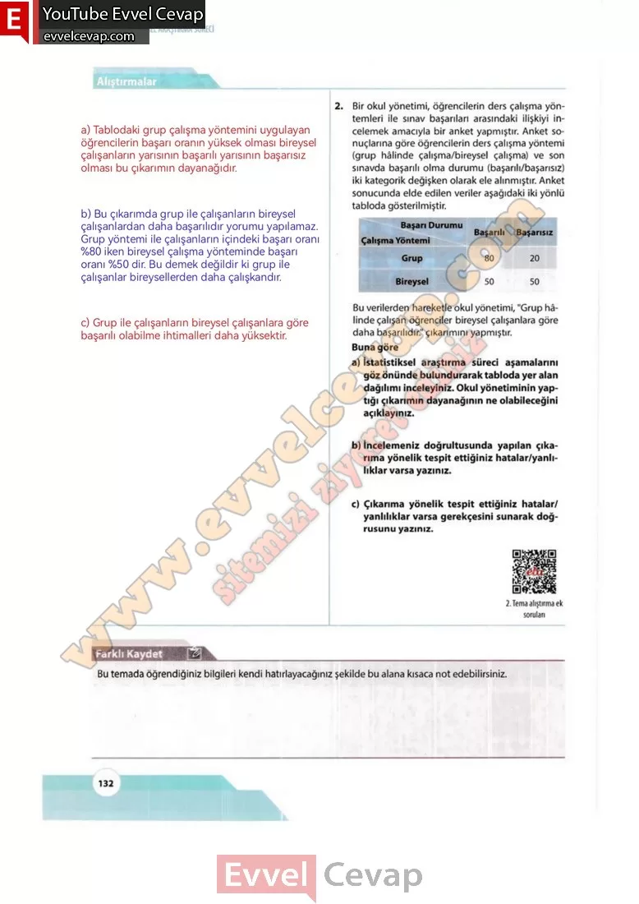

## 10. Sınıf Matematik Ders Kitabı Cevapları Meb Yayınları Sayfa 132

**Alıştırmalar**

**Soru: 1)** Bir işletmeci, alışveriş merkezine gelen müşterilerin alışveriş eğilimlerini öğrenmek için müşterilerin yaş grupları ile tercih ettikleri ürün kategorileri arasındaki ilişkiyi incelemek üzere bir araştırmacıdan analiz istemiştir. Araştırmacı, verileri topladıktan sonra elde ettiği sonuçları kümeli sütun grafiğiyle sunmuştur. İşletmeci, grafiği yorumlayarak “Genç müşteriler daha çok teknoloji ve giyim ürünleri tercih etmekte fakat ileri yaş gruplan daha çok sağlık ve gıda ürünlerine yönelmektedir. **Bu durumda yaş arttıkça teknoloji ve giyim alışverişi azalır, gıda ve sağlık alışverişi artar.” şeklinde bir değerlendirmede bulunmuştur. Buna göre**

**Soru: a) İstatistiksel araştırma süreci aşamalarını göz önünde bulundurarak grafikte yer alan dağılımı inceleyiniz. İşletmecinin yaptığı değerlendirmenin dayanağının ne olabileceğini açıklayınız.**

**Soru: b) İncelemeniz doğrultusunda yapılan değerlendirmeye yönelik tespit ettiğiniz hatalar/ yanlılıklar varsa yazınız.**

**Soru: c) Değerlendirmede tespit ettiğiniz hatalar/ yanlılıklar varsa gerekçesini sunarak doğrusunu yazınız.**

**Soru: 2)** Bir okul yönetimi, öğrencilerin ders çalışma yöntemleri ile sınav başarıları arasındaki ilişkiyi incelemek amacıyla bir anket yapmıştır. Anket sonuçlarına göre öğrencilerin ders çalışma yöntemi (grup hâlinde çalışma/bireysel çalışma) ve son sınavda başarılı olma durumu (başarılı/başarısız) iki kategorik değişken olarak ele alınmıştır. Anket sonucunda elde edilen veriler aşağıdaki iki yönlü tabloda gösterilmiştir. **Bu verilerden hareketle okul yönetimi, “Grup hâlinde çalışan öğrenciler bireysel çalışanlara göre daha başarılıdır.” çıkarımını yapmıştır. Buna göre**

**Soru: a) İstatistiksel araştırma süreci aşamalarını göz önünde bulundurarak tabloda yer alan dağılımı inceleyiniz. Okul yönetiminin yaptığı çıkarımın dayanağının ne olabileceğini açıklayınız.**

**Soru: b) İncelemeniz doğrultusunda yapılan çıkarıma yönelik tespit ettiğiniz hatalar/yanls- lıklar varsa yazınız.**

**Soru: c) Çıkarıma yönelik tespit ettiğiniz hatalar/yanlılıklar varsa gerekçesini sunarak doğrusunu yazınız.**

**Soru: Bu temada öğrendiğiniz bilgileri kendi hatırlayacağınız şekilde bu alana kısaca not edebilirsiniz.**

  
 

**10. Sınıf Meb Yayınları Matematik Ders Kitabı Sayfa 132**