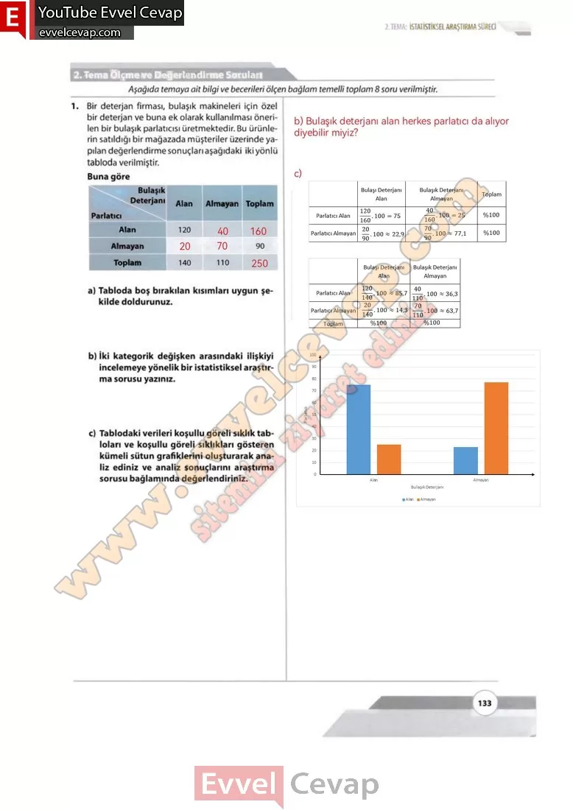
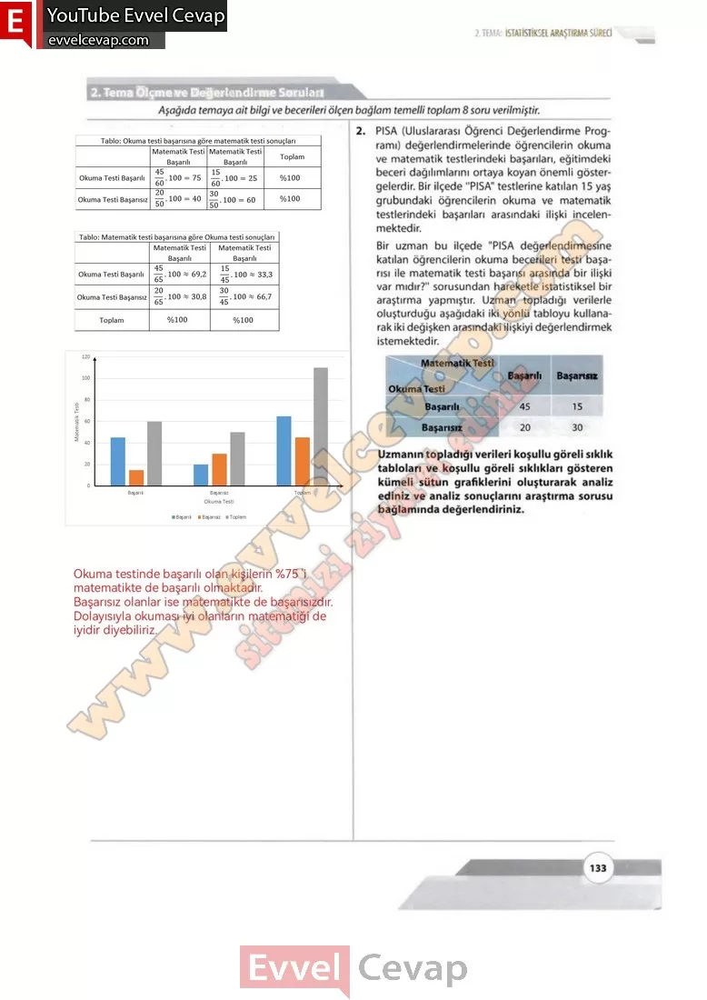

## 10. Sınıf Matematik Ders Kitabı Cevapları Meb Yayınları Sayfa 133

**Soru: 1) Bir deterjan firması, bulaşık makineleri için özel bir deterjan ve buna ek olarak kullanılması önerilen bir bulaşık parlatıcısı üretmektedir. Bu ürünlerin satıldığı bir mağazada müşteriler üzerinde yapılan değerlendirme sonuçları aşağıdaki iki yönlü tabloda verilmiştir. Buna göre**

**Soru: a) Tabloda boş bırakılan kısımları uygun şe kilde doldurunuz.**

**Soru: b) İki kategorik değişken arasındaki ilişkiyi incelemeye yönelik bir istatistiksel araştırma sorusu yazınız.**

**Soru: c) Tablodaki verileri koşullu göreli sıklık tabloları ve koşullu göreli sıklıkları gösteren kümeli sütun grafiklerini oluşturarak analiz ediniz ve analiz sonuçlarını araştırma sorusu bağlamında değerlendiriniz.**

**Soru: 2)** PISA (Uluslararası Öğrenci Değerlendirme Programı) değerlendirmelerinde öğrencilerin okuma ve matematik testlerindeki başarıları, eğitimdeki beceri dağılımlarını ortaya koyan önemli göstergelerdir. Bir ilçede “PISA” testlerine katılan 15 yaş grubundaki öğrencilerin okuma ve matematik testlerindeki başarıları arasındaki ilişki İncelenmektedir. Bir uzman bu ilçede “PISA değerlendirmesine katılan öğrencilerin okuma becerileri testi başarısı ile matematik testi başarısı arasında bir ilişki var mıdır?” sorusundan hareketle istatistiksel bir araştırma yapmıştır. Uzman topladığı verilerle oluşturduğu aşağıdaki iki yönlü tabloyu kullanarak iki değişken arasındaki ilişkiyi değerlendirmek istemektedir. **Uzmanın topladığı verileri koşullu göreli sıklık tabloları ve koşullu göreli sıklıkları gösteren kümeli sütun grafiklerini oluşturarak analiz ediniz ve analiz sonuçlarını araştırma sorusu bağlamında değerlendiriniz.**

  
 

**10. Sınıf Meb Yayınları Matematik Ders Kitabı Sayfa 133**