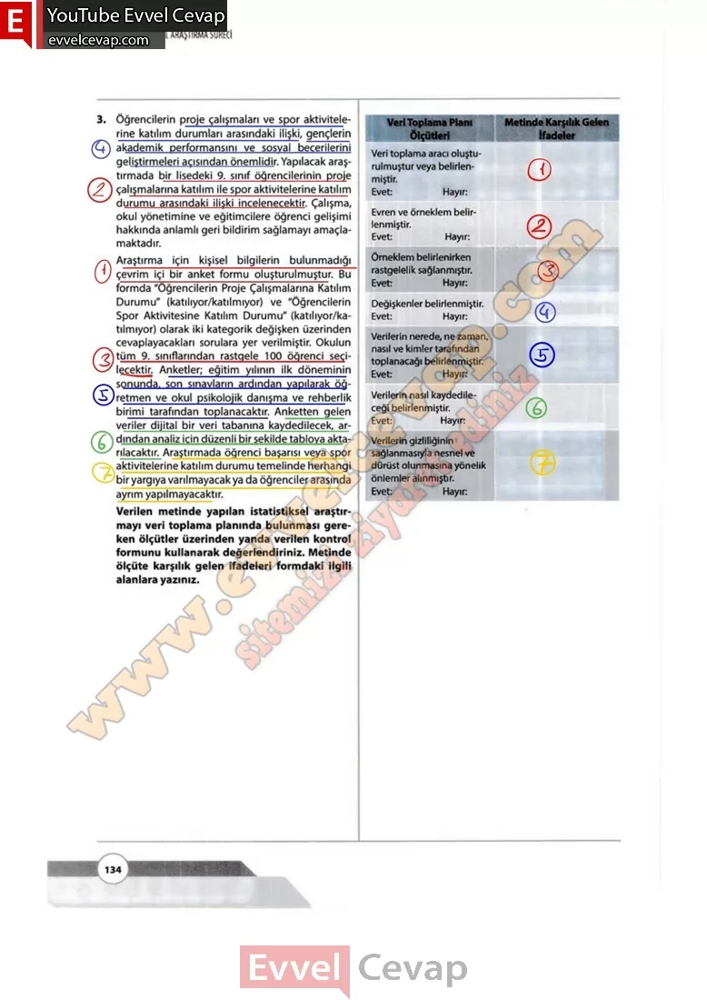

## 10. Sınıf Matematik Ders Kitabı Cevapları Meb Yayınları Sayfa 134

**Soru: 3)** Öğrencilerin proje çalışmaları ve spor aktivitelerine katılım durumları arasındaki ilişki, gençlerin akademik performansını ve sosyal becerilerini geliştirmeleri açısından önemlidir. Yapılacak araştırmada bir lisedeki 9. sınıf öğrencilerinin proje çalışmalarına katılım ile spor aktivitelerine katılım durumu arasındaki ilişki incelenecektir. Çalışma, okul yönetimine ve eğitimcilere öğrenci gelişimi hakkında anlamlı geri bildirim sağlamayı amaçlamaktadır. Araştırma için kişisel bilgilerin bulunmadığı çevrim içi bir anket formu oluşturulmuştur. Bu formda “Öğrencilerin Proje Çalışmalarına Katılım Durumu” (katılıyor/katılmıyor) ve “Öğrencilerin Spor Aktivitesine Katılım Durumu” (katılıyor/ka- tılmıyor) olarak iki kategorik değişken üzerinden cevaplayacakları sorulara yer verilmiştir. Okulun tüm 9. sınıflarından rastgele 100 öğrenci seçilecektir. Anketler; eğitim yılının ilk döneminin sonunda, son sınavların ardından yapılarak öğretmen ve oku! psikolojik danışma ve rehberlik birimi tarafından toplanacaktır. Anketten gelen veriler dijital bir veri tabanına kaydedilecek, ardından analiz için düzenli bir şekilde tabloya aktarılacaktır. Araştırmada öğrenci başarısı veya spor aktivitelerine katılım durumu temelinde herhangi bir yargıya varılmayacak ya da öğrenciler arasında ayrım yapılmayacaktır. **Verilen metinde yapılan İstatistiksel araştırmayı veri toplama planında bulunması gereken ölçütler üzerinden yanda verilen kontrol formunu kullanarak değerlendiriniz. Metinde ölçüte karşılık gelen ifadeleri formdaki ilgili alanSara yazınız.**

**10. Sınıf Meb Yayınları Matematik Ders Kitabı Sayfa 134**