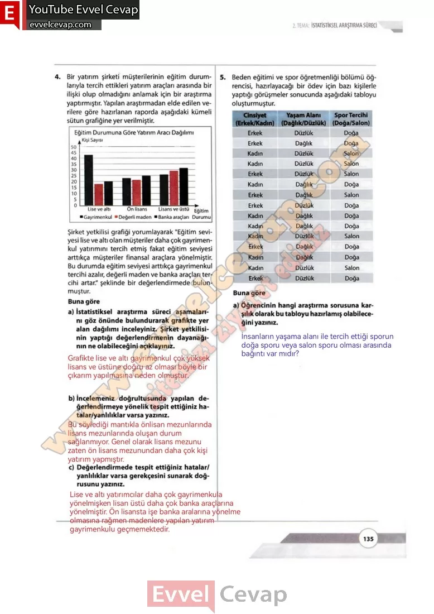

## 10. Sınıf Matematik Ders Kitabı Cevapları Meb Yayınları Sayfa 135

**Soru: 4)** Bir yatırım şirketi müşterilerinin eğitim durumlarıyla tercih ettikleri yatırım araçları arasında bir ilişki olup olmadığını anlamak için bir araştırma yaptırmıştır. Yapılan araştırmadan elde edilen verilere göre hazırlanan raporda aşağıdaki kümeli sütun grafiğine yer verilmiştir. Şirket yetkilisi grafiği yorumlayarak “Eğitim seviyesi lise ve altı olan müşteriler daha çok gayrimenkul yatırımını tercih etmiş fakat eğitim seviyesi arttıkça müşteriler finansal araçlara yönelmiştir. **Bu durumda eğitim seviyesi arttıkça gayrimenkul tercihi azalır, değerli maden ve banka araçları tercihi artar.” şeklinde bir değerlendirmede bulunmuştur. Buna göre**

**Soru: a) İstatistiksel araştırma süreci aşamalarını göz önünde bulundurarak grafikte yer alan dağılımı inceleyiniz. Şirket yetkilisinin yaptığı değerlendirmenin dayanağının ne olabileceğini açıklayınız.**

**Soru: b) İncelemeniz doğrultusunda yapılan değerlendirmeye yönelik tespit ettiğiniz hatalar/yanlılıklar varsa yazınız.**

**Soru: c) Değerlendirmede tespit ettiğiniz hatalar/ yanlılıklar varsa gerekçesini sunarak doğrusunu yazınız.**

**Soru: 5) Beden eğitimi ve spor öğretmenliği bölümü öğrencisi, hazırlayacağı bir ödev için bazı kişilerle yaptığı görüşmeler sonucunda aşağıdaki tabloyu oluşturmuştur. Buna göre**

**Soru: a) Öğrencinin hangi araştırma sorusuna karşılık olarak bu tabloyu hazırlamış olabileceğini yazınız.**

**10. Sınıf Meb Yayınları Matematik Ders Kitabı Sayfa 135**