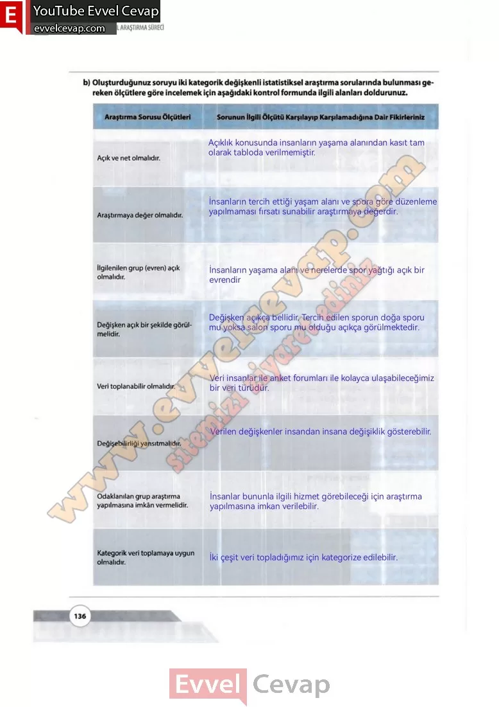

## 10. Sınıf Matematik Ders Kitabı Cevapları Meb Yayınları Sayfa 136

**Soru: b) Oluşturduğunuz soruyu iki kategorik değişkenli istatistiksel araştırma sorularında bulunması gereken ölçütlere göre incelemek için aşağıdaki kontrol formunda ilgili alanları doldurunuz.**

Açık ve net olmalıdır.  
 Araştırmaya değer olmalıdır.  
 İlgilenilen grup (evren) açık olmalıdır.  
 Değişken açık bir şekilde görülmelidir.  
 Veri toplanabilir olmalıdır.  
 Değişebilirliği yansıtmalıdır.  
 Odaklanılan grup araştırma yapılmasına imkân vermelidir.  
 Kategorik veri toplamaya uygun olmalıdır.

**10. Sınıf Meb Yayınları Matematik Ders Kitabı Sayfa 136**