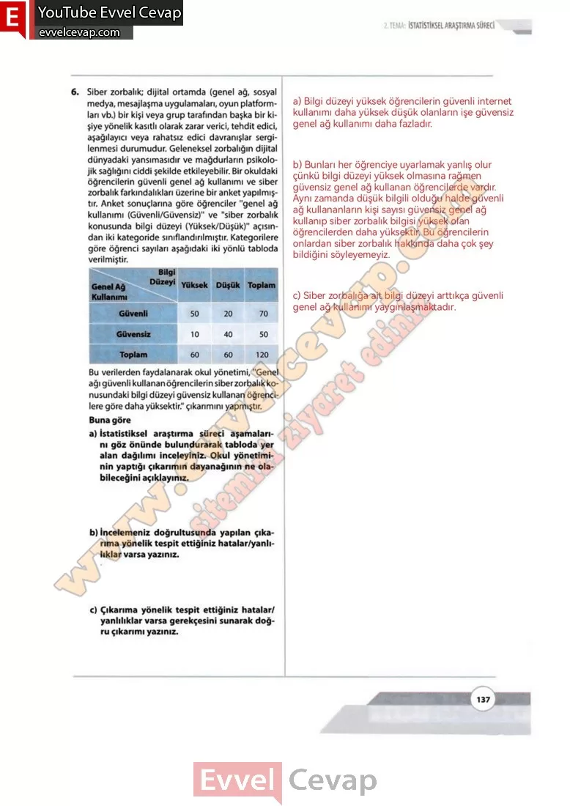
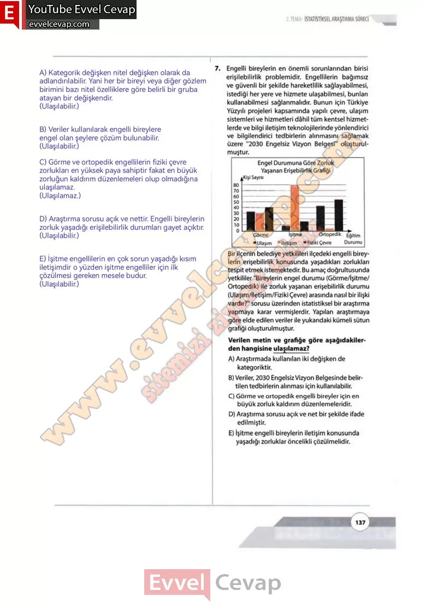

## 10. Sınıf Matematik Ders Kitabı Cevapları Meb Yayınları Sayfa 137

**Soru: 6)** Siber zorbalık; dijital ortamda (genel ağ, sosyal medya, mesajlaşma uygulamaları, oyun platformları vb.) bir kişi veya grup tarafından başka bir kişiye yönelik kasıtlı olarak zarar verici, tehdit edici, aşağılayıcı veya rahatsız edici davranışlar sergilenmesi durumudur. Geleneksel zorbalığın dijital dünyadaki yansımasıdır ve mağdurların psikolojik sağlığını ciddi şekilde etkileyebilir. Bir okuldaki öğrencilerin güvenli genel ağ kullanımı ve siber zorbalık farkındalıkları üzerine bir anket yapılmıştır. Anket sonuçlarına göre öğrenciler “genel ağ kullanımı (Güvenli/Güvensiz)” ve “siber zorbalık konusunda bilgi düzeyi (Yüksek/Düşük)” açısından iki kategoride sınıflandırılmıştır. Kategorilere göre öğrenci sayıları aşağıdaki iki yönlü tabloda verilmiştir. **Bu verilerden faydalanarak okul yönetimi, “Genel ağı güvenli kullanan öğrencilerin siber zorbalık konusundaki bilgi düzeyi güvensiz kullanan öğrencilere göre daha yüksektir.” çıkarımını yapmıştır. Buna göre**

**Soru: a) İstatistiksel araştırma süreci aşamalarını göz önünde bulundurarak tabloda yer alan dağılımı inceleyiniz. Okul yönetiminin yaptığı çıkarımın dayanağının ne olabileceğini açıklayınız.**

**Soru: b) İncelemeniz doğrultusunda yapılan çıkarıma yönelik tespit ettiğiniz hatalar/yanlılıklar varsa yazınız.**

**Soru: c) Çıkarıma yönelik tespit ettiğiniz hatalar/ yanlılıklar varsa gerekçesini sunarak doğru çıkarımı yazınız.**

**Soru: 7)** Engelli bireylerin en önemli sorunlarından birisi erişilebilirlik problemidir. Engellilerin bağımsız ve güvenli bir şekilde hareketlilik sağlayabilmesi, istediği her yere ve hizmete ulaşabilmesi, bunları kullanabilmesi sağlanmalıdır. Bunun için Türkiye Yüzyılı projeleri kapsamında yapılı çevre, ulaşım sistemleri ve hizmetleri dâhil tüm kentsel hizmetlerde ve bilgi iletişim teknolojilerinde yönlendirici ve bilgilendirici tedbirlerin alınmasını sağlamak üzere “2030 Engelsiz Vizyon Belgesi” oluşturulmuştur. Bir ilçenin belediye yetkilileri ilçedeki engelli bireylerin erişebilirlik konusunda yaşadıkları zorlukları tespit etmek istemektedir. Bu amaç doğrultusunda yetkililer “Bireylerin engel durumu (Görme/İşitme/ Ortopedik) ile zorluk yaşanan erişebilirlik durumu (Ulaşım/İletişim/Fiziki Çevre) arasında nasıl bir ilişki vardır?” sorusu üzerinden istatistiksel bir araştırma yapmaya karar vermişlerdir. Yapılan araştırmaya göre elde edilen veriler ile yukarıdaki kümeli sütun grafiği oluşturulmuştur. **Verilen metin ve grafiğe göre aşağıdakilerden hangisine ulaşılamaz?**

A) Araştırmada kullanılan iki değişken de kategoriktir.  
 B) Veriler, 2030 Engelsiz Vizyon Belgesinde belirtilen tedbirlerin alınması için kullanılabilir.  
 C) Görme ve ortopedik engelli bireyler için en büyük zorluk kaldırım düzenlemeleridir.  
 D) Araştırma sorusu açık ve net bir şekilde ifade edilmiştir.  
 E) İşitme engelli bireylerin iletişim konusunda yaşadığı zorluklar öncelikli çözülmelidir.

  
 

**10. Sınıf Meb Yayınları Matematik Ders Kitabı Sayfa 137**