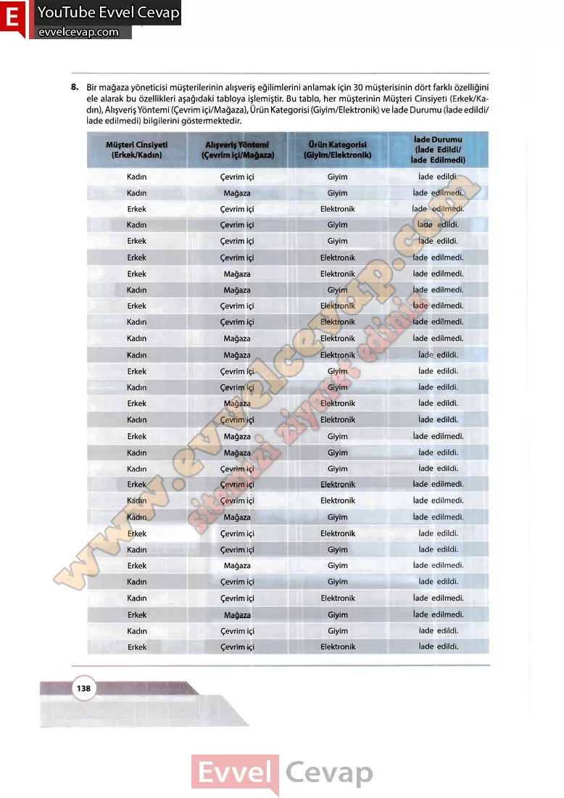

## 10. Sınıf Matematik Ders Kitabı Cevapları Meb Yayınları Sayfa 138

**Soru: 8) Bir mağaza yöneticisi müşterilerinin alışveriş eğilimlerini anlamak için 30 müşterisinin dört farklı özelliğini ele alarak bu özellikleri aşağıdaki tabloya işlemiştir. Bu tablo, her müşterinin Müşteri Cinsiyeti (Erkek/Kadın), Alışveriş Yöntemi (Çevrim içi/Mağaza), Ürün Kategorisi (Giyim/Elektronik) ve İade Durumu (İade edildi/ İade edilmedi) bilgilerini göstermektedir.**

**10. Sınıf Meb Yayınları Matematik Ders Kitabı Sayfa 138**