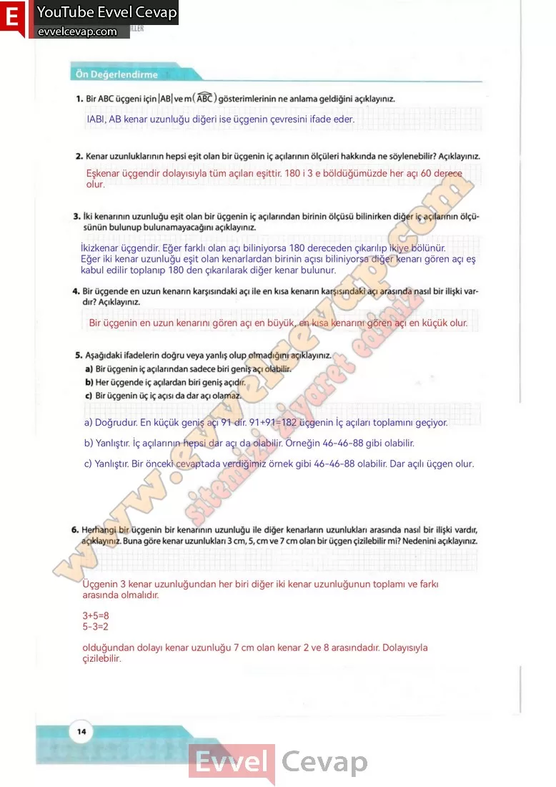
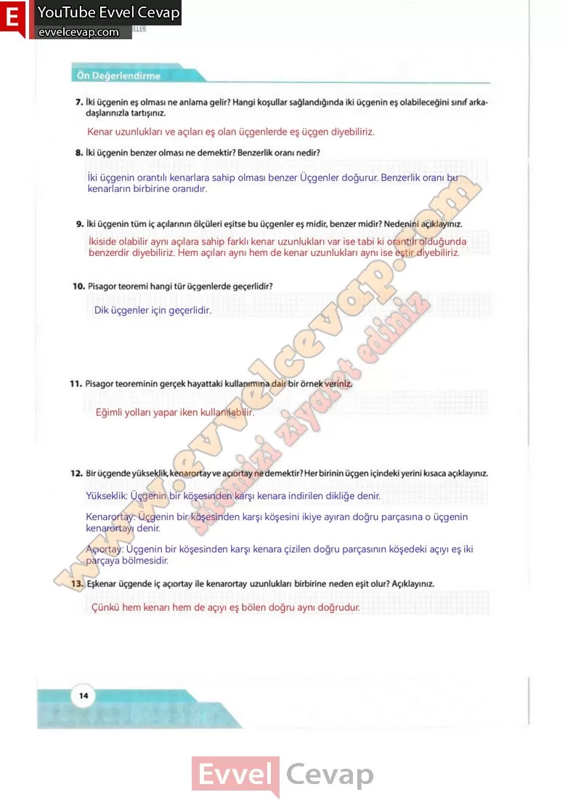

## 10. Sınıf Matematik Ders Kitabı Cevapları Meb Yayınları Sayfa 14

**Konuya Başlarken**

Yelkenlilerde direk uzunsa halatlarla güverteye sabit- lenerek güçlendirilir. Yanda [AC] yelkenli direğinin güverte tabanına sabitlenmesi amacıyla birbirine paralel konumlandırılmış [CD] ve [BE] halatlarından oluşan görsel verilmiştir. Görseldeki direk güverte tabanına dik; A, B, C noktaları direk üzerinde ve doğrusal; A, E, D noktaları güverte tabanı üzerinde ve doğrusaldır. (Halatların kalınlığını dikkate almayınız.) Buna göre

**Soru:  1) Halatların uzunlukları ile direk uzunluğu bilindiğinde kısa halatın direk ile bağlantı noktası elan B nin güverteye uzaklığının (|BA| nun) hangi yöntemlerle bulunabileceğini öğretmeninizin rehberliğinde sınıf arkadaşlarınızla tartışınız.**

**Soru: 2) Uzun halatın uzunluğunun direğin boyuna oranı ile kısa halatın uzunluğunun |BA| na oranı arasındaki ilişkiyi belirleyiniz.**

**1. Uygulama**

Bir Dik Üçgende Dar Açıların Trigonometrik Oranları  
 Öğretmeninizin rehberliğinde sınıfta üç farklı gruba ayrılınız. 1, 2 ve 3. adımları grubunuz ile uygulayınız.  
 4. adımda diğer grupların yaptığı sunumları dikkate alarak 1 ve 3. adımdaki diğer gruplara ait alanları uygun şekilde doldurunuz. Uygulamaya soruları cevaplandırarak devam ediniz.

**Soru: 1) Öğretmeninizin belirleyeceği şekilde 3-4-5 üçgeni ile benzer ve kenar uzunlukları tam sayı olan üç farklı üçgeni her grup için oluşturulmuş çizim alanlarına çiziniz.**

**Soru: Çizdiğiniz her bir dik üçgenin en küçük dar açısının ölçüsünü a olarak isimlendiriniz.**

**Soru: 2) Çizdiğiniz üçgeni dikkate alarak üçgenin bir dar açısına göre kenar uzunluklarının oranları ile ilişkisini ifade eden varsayımlarınızı aşağıda verilen örnekteki gibi oluşturunuz.**

  
 

**10. Sınıf Meb Yayınları Matematik Ders Kitabı Sayfa 14**