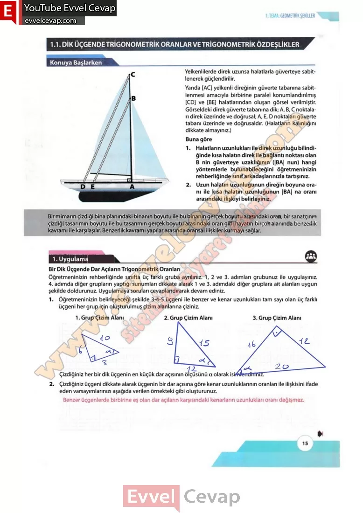

## 10. Sınıf Matematik Ders Kitabı Cevapları Meb Yayınları Sayfa 15

**Soru: 3) Aşağıdaki tabloyu çizdiğiniz üçgenden faydalanarak size ayrılan sütunu grup arkadaşlarınızla doldurunuz.**

**Soru: 4) Grup olarak yukarıdaki tabloda oranlardan elde ettiğiniz sonuçları sınıfta sununuz. Diğer grupların elde ettiği sonuçları da tablodaki uygun kısımlara yazınız.**

**Soru: 5) Sınıfça her üç grubun bulduğu oranları karşılaştırarak açı ve oranlara ait incelemelerinizi yapınız.**

**Soru: 6) İncelemelerinizden ve varsayımlardan faydalanarak bir dik üçgenin açıları ve kenarlan arasındaki ilişki ile ilgili genellemelerinizi aşağıda verilen örnekteki gibi oluşturunuz.**

**Soru: 7) Varsayımlarınız ile genellemelerinizi karşılaştırınız. Aşağıda verilen üçgenler için oluşturulan tabloları inceleyerek istenilenleri gerçekleştiriniz.**

**Soru: a) Aşağıda Tablo 1 ‘de verilen değerler dik üçgenlerin dar açılarının sinüs ve kosinüs değerleridir. Bu oransal değerleri üçgenlerin dar açılarına göre bulunan karşı kenar, komşu kenar ve hipotenüs ifadelerini kullanarak yazınız.**

**10. Sınıf Meb Yayınları Matematik Ders Kitabı Sayfa 15**