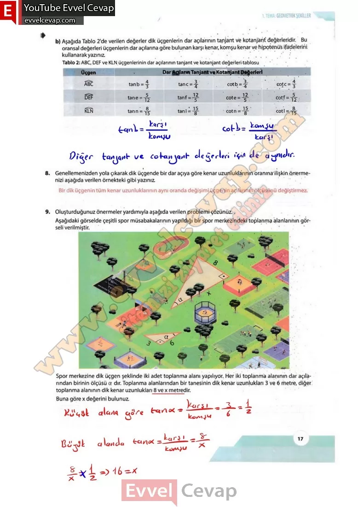

## 10. Sınıf Matematik Ders Kitabı Cevapları Meb Yayınları Sayfa 17

Aşağıdaki görselde kıyı şeridinde bulunan Aykan ve Buse ile bir ada üzerinde bulunan deniz fenerinin bulunduğu noktalar yer almaktadır. Aykan, bulunduğu A noktasından önce adadaki D noktasına ve ardından Bu- se’nin bulunduğu B noktasına yüzmüş- tür. Daha sonra doğrusal olarak 13m/dk. sabit hızla 50 dakika yürüyerek ilk konumuna geri dönmüştür. D, A ve B noktalarının oluşturduğu üçgende DAB açısının ölçüsü 22° ve DBA açısının ölçüsü 31°dir. Buna göre deniz fenerinin sahiBe uzaklığının yaklaşık olarak kaç metre olduğunu bulunuz.

**1. Sıra Sizde**

**Soru: Yandaki görselde yere dik duran iki direk arasında bir ip ile oluşturulan zipline (ziplayn) parkurundaki bir kişinin anlık görüntüsü verilmiştir. Uzun ve kısa direğin ip ile yaptığı açı ölçüleri sırasıyla 75° ve 85°dir. Uzun direğin yüksekliği 50 m, koşa direğin yüksekliği 33 m ve bu kişinin bulunduğu noktadaki ipin yerden yüksekliği 32 m olduğuna göre iki direk arasındaki en kısa uzaklığın yaklaşık olarak kaç metre olduğunu bulunuz.**

**10. Sınıf Meb Yayınları Matematik Ders Kitabı Sayfa 17**