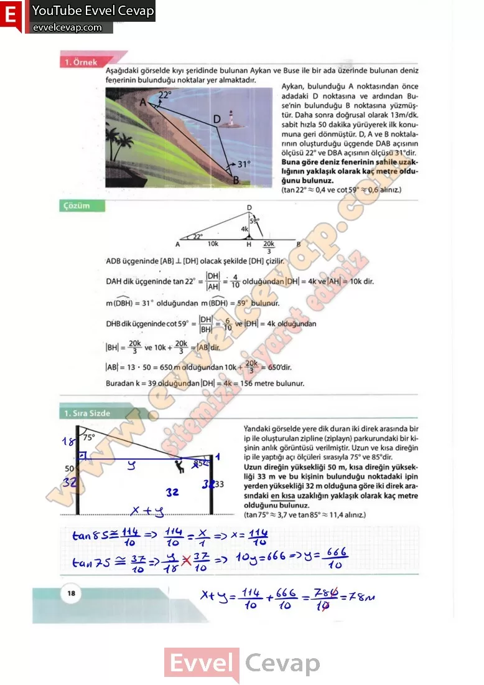

## 10. Sınıf Matematik Ders Kitabı Cevapları Meb Yayınları Sayfa 18

**2. Uygulama**

**Trigonometrik Özdeşlikler**

Öğretmeninizin rehberliğinde sınıfta üç farklı gruba ayrılınız. 1, 2 ve 3. adımları grubunuz ile uygulayınız. 4. adımda diğer grupların yaptığı sunumları dikkate alarak 1 ve 3. adımlardaki diğer gruplara ait alanları uygun şekilde doldurunuz. Uygulamaya soruları cevaplandırarak devam ediniz.

**Soru: Her grup için oluşturulmuş çizim alanlarına aşağıda verilen üçgenleri çiziniz.  
 1. grup: 3 – 4 – 5 dik üçgeni  
 2. grup: 5 – 12 – 13 dik üçgeni  
 3. grup: m (A) = 90° ve m(B) < m(C) olacak şekilde bir ABC dik üçgeni çiziniz ve |AC| = b, |AB| = c ve |BC| = a olarak isimlendiriniz.**

**Soru: Çizdiğiniz her bir diküçgenin en küçük iç açısının ölçüsünü a ve diğer iç açının ölçüsünü |3 olarak isimlendiriniz.**

**Soru: 2) Öğrendiğiniz trigonometrik oranları kullanarak yazılabilecek özdeşlikler ile ilgili varsayımlarda bulununuz.**

**Soru: 3) Çizdiğiniz üçgenlerden hareketle grubunuzla aşağıda verilen tabloyu örnekteki gibi doldurunuz.**

**Soru: 4) Grup olarak elde ettiğiniz sonuçları grup sözcüsü seçerek sınıfta sununuz.**

**10. Sınıf Meb Yayınları Matematik Ders Kitabı Sayfa 18**