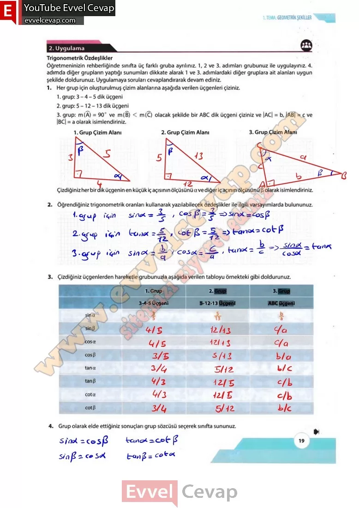

## 10. Sınıf Matematik Ders Kitabı Cevapları Meb Yayınları Sayfa 19

**Soru: 5) Elde ettiğiniz trigonometrik oranları dikkate alarak sınıfça her üç grubun bulduğu sonuçları karşılaştırıp Pisagor teoremi kullanarak veya cebirsel işlemlerden yararlanarak oluşturabileceğiniz özdeşlikler ile ilgili aşağıda istenen genellemelerinizi oluşturunuz.**

**Soru: a) Bir dar açının sinüs ve kosinüs değerlerinin kareleri toplamı ile ilgili genelleme oluşturunuz.**

**Soru: b) Bir dar açının tanjant ve kotanjant değerlerinin çarpımı ile ilgili genelleme oluşturunuz.**

**Soru: c) İki dar açının sinüs-kosinüs, tanjant-kotanjant değerlerinin birbirine eşitliği ile ilgili genelleme oluşturunuz.**

**Soru: 6) Genellemelerinizi varsayımlarınızla karşılaştırmak için arkadaşlarınızla farklı dik üçgenler üzerinde uygulama adımlarını tekrarlayınız ve ulaştığınız sonuçları inceleyiniz. Oluşturduğunuz genellemeleri bir önerme olarak ifade ediniz.**

**Soru: 7) Oluşturduğunuz önerme yardımıyla aşağıda verilen problemi çözünüz.**

Yanda her iki ayağı zeminle 50°lik açı yapacak şekilde yerleştirilmiş iş merdiveni görseli verilmiştir.  
 Merdivenin bir kenarının uzunluğu 2,5 metredir. Merdiven ayaklarının daha fazla açılarak kullanıcının iş güvenliğinin tehlikeye atılmaması için ayakların zemin ile temas ettiği iki nokta arası bir ip ile emniyete alınıyor.  
 Buna göre kullanılacak ipin uzunluğunun en az kaç metre olması gerektiğini bulunuz. (sin40° ~ 0,6 alınız.)

**10. Sınıf Meb Yayınları Matematik Ders Kitabı Sayfa 19**