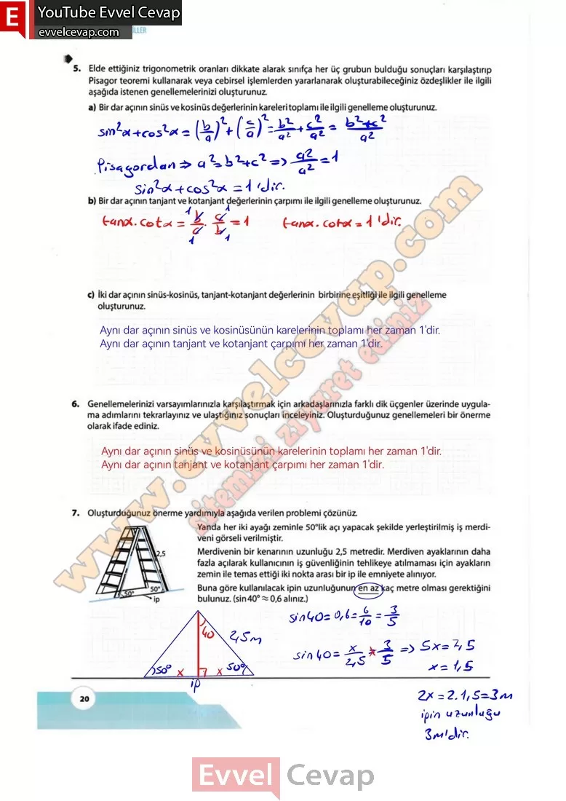

## 10. Sınıf Matematik Ders Kitabı Cevapları Meb Yayınları Sayfa 20

Çok ince metal tel üretimi yapan bir firma “Sin” ve “Kos” adını verdiği sırasıyla mavi ve kırmızı boyalı iki farklı metal tel üretiyor. Firma müşterinin 0° < x < 90° aralığında seçtiği bir açı ölçüsünün sinüs ve kosinüs değerine karşılık gelen birim uzunluğunda ikişer metal tel üretip müşteriye teslim ediyor. Şekil 1 ‘de bir müşterinin seçtiği x ölçüsüne göre üretilmiş metal teller ve bu tellerin uzunlukları arasındaki fark gösterilmiştir.

**2. Sıra Sizde**

**Soru: Aşağıda mavi, yeşil, turuncu kareler aralarında boşluk kalmayacak ve birbiri üzerine taşmayacak şekilde görseldeki gibi yerleştirilmiştir. 0° < x < 90° olmak üzere derece cinsinden açı ölçüsü x olan mavi karenin bir kenarının uzunluğu tanx, yeşil karenin bir kenarının uzunluğu cotx olarak veriliyor. Mavi ve yeşil karelerin alanları toplamı 14 birimkare olduğuna göre turuncu karenin alanının kaç birimkare olduğunu bulunuz.**

**10. Sınıf Meb Yayınları Matematik Ders Kitabı Sayfa 20**