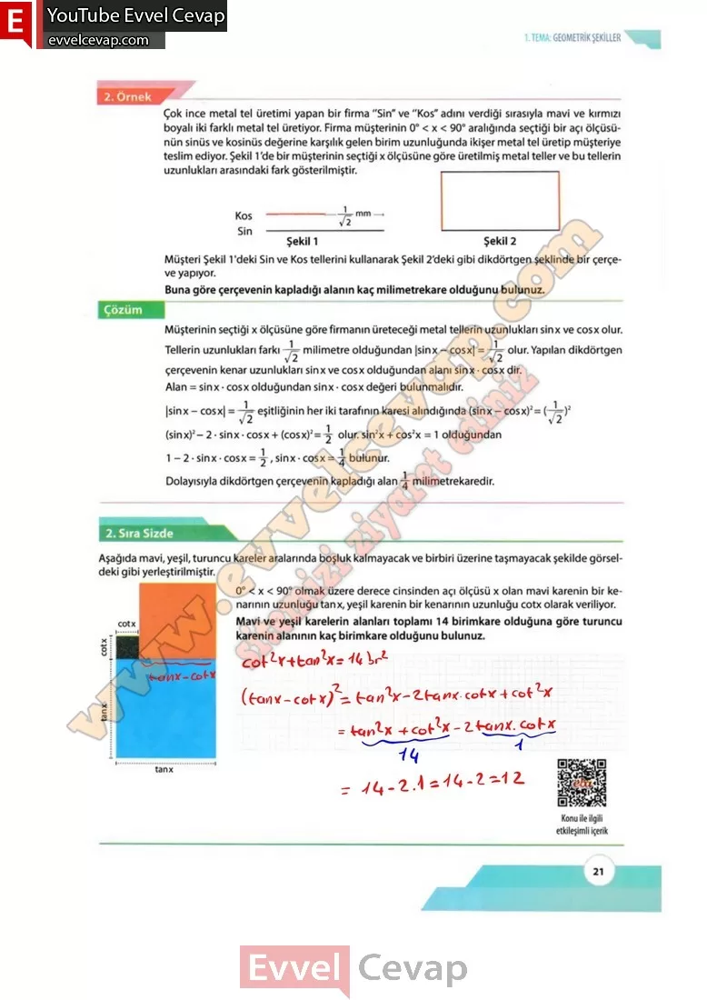

## 10. Sınıf Matematik Ders Kitabı Cevapları Meb Yayınları Sayfa 21

**3. Uygulama**

**Soru: Ölçüleri 30°, 45° ve 60° Olan Açıların Trigonometrik Oranları Öğretmeninizin rehberliğinde sınıfta iki gruba ayrılınız.**

**Soru: 1) Aşağıdaki tablolarda gruplar için verilen adımları sırasıyla uygulayınız.**

**Soru: 1) Bir kenarının uzunluğu 2 cm olan ABC eşkenar üçgeni çiziniz.**

**Soru: 2) BC kenarının orta noktasını bularak bu noktayı H olarak isimlendiriniz. H noktasını A noktası ile doğrusal olarak birleştiriniz.**

**Soru: 3) Oluşan BHA üçgenindeki ABH ile BAH nın ölçülerinin kaç derece olduğunu yazınız.**

**Soru: 4) BHA üçgeninin kenar uzunluklarını bulunuz.**

**Soru: 5) BAH açısına ait trigonometrik oranları bulunuz.**

**Soru: 6) ABH açısına ait trigonometrik oranları bulunuz.**

**Soru: 1) m(A) = 90° olacak şekilde dik kenar uzunlukları 3 cm olan bir ABC ikizkenar dik üçgeni çiziniz.**

**Soru: 2) Oluşan ABC üçgenindeki ABC ile ACB nın ölçülerinin kaç derece olduğunu yazınız.**

**Soru: 3) ABC ikizkenar dik üçgeninin hipotenüs uzunluğunu bulunuz.**

**Soru: 4) BC Aaçısına ait trigonometrik oranları bulunuz.**

**10. Sınıf Meb Yayınları Matematik Ders Kitabı Sayfa 21**