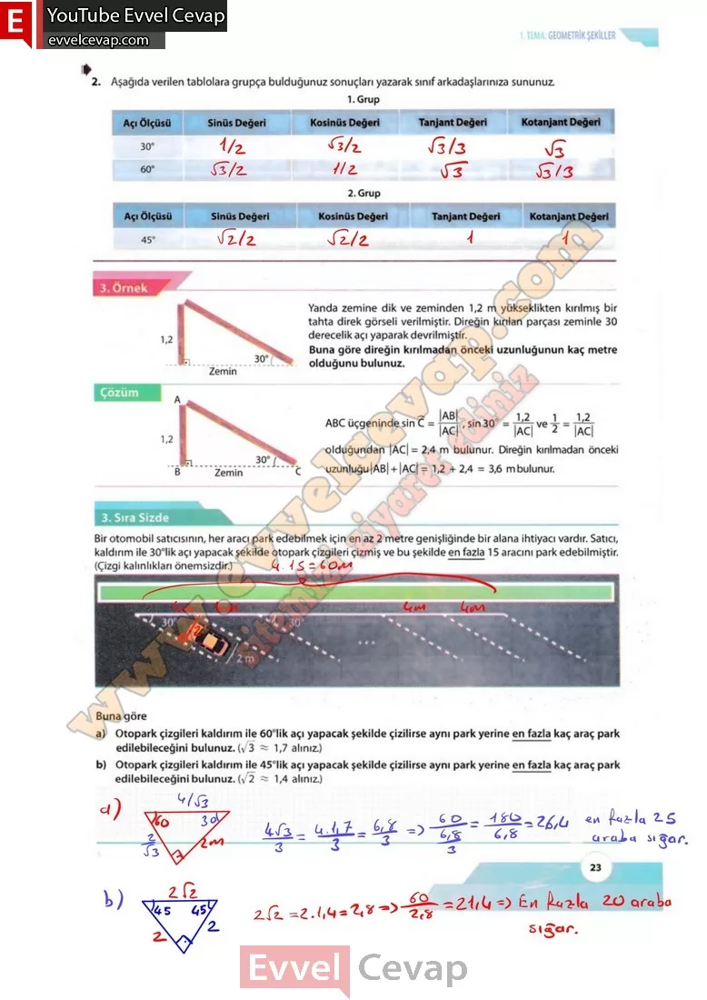

## 10. Sınıf Matematik Ders Kitabı Cevapları Meb Yayınları Sayfa 23

**Soru: 2) Aşağıda verilen tablolara grupça bulduğunuz sonuçları yazarak sınıf arkadaşlarınıza sununuz.**

**3. Sıra Sizde**

**Soru: Bir otomobil satıcısının, her aracı park edebilmek için en az 2 metre genişliğinde bir alana ihtiyacı vardır. Satıcı, kaldırım ile 30°lik açı yapacak şekilde otopark çizgileri çizmiş ve bu şekilde en fazla 15 aracını park edebilmiştir. (Çizgi kalınlıkları önemsizdir.) Buna göre**

**Soru: a) Otopark çizgileri kaldırım ile 60°lik açı yapacak şekilde çizilirse aynı park yerine en fazla kaç araç park edilebileceğini bulunuz.**

**Soru: b) Otopark çizgileri kaldırım ile 45°lik açı yapacak şekilde çizilirse aynı park yerine en fazla kaç araç park edilebileceğini bulunuz.**

**10. Sınıf Meb Yayınları Matematik Ders Kitabı Sayfa 23**