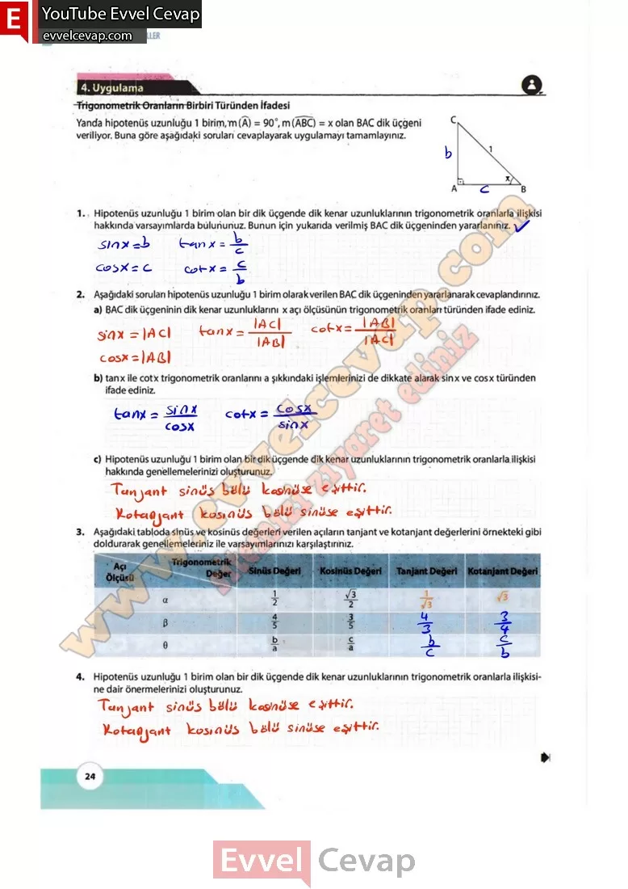

## 10. Sınıf Matematik Ders Kitabı Cevapları Meb Yayınları Sayfa 24

**4. Uygulama**

**Soru: Trigonometrik Oranların Birbiri Türünden İfadesi Yanda hipotenüs uzunluğu 1 birim m(A) = 90°, m (ABC) = x olan BAC dik üçgeni veriliyor, Buna göre aşağıdaki soruları cevaplayarak uygulamayı tamamlayınız.**

**Soru: 1) Hipotenüs uzunluğu 1 birim olan bir dik üçgende dik kenar uzunluklarının trigonometrik oranlarla ilişkisi hakkında varsayımlarda bülununuz. Bunun için yukarıda verilmiş BAC dik üçgeninden yararlanınız.**

**Soru: 2) Aşağıdaki soruları hipotenüs uzunluğu 1 birim olarak verilen BAÇ dik üçgeninden yararlanarak cevaplandırınız,**

**Soru: a) BAC dik üçgeninin dik kenar uzunluklarını x açı ölçüsünün trigonometrik oranları-türünden ifade ediniz.**

**Soru: b) tanx ile cotx trigonometrik oranlarını a şıkkındaki işlemlerinizi de dikkate alarak sinx ve cosx türünden ifade ediniz.**

**Soru: c) Hipotenüs uzunluğü 1 birim olan bir dik üçgende dik kenar uzunluklarının trigonometrik oranlarla ilişkisi hakkında genellemelerinizi oluşturunuz.**

**Soru: 3) Aşağıdaki,tabloda sinüs ve kosınüs değerleri verilen açıların tanjant ve kotanjant değerlerini örnekteki gibi doldurarak genellemeleriniz ile.varsayımlarınızı karşılaştırınız.**

**Soru: 4) Hipotenüs uzunluğu 1 birim olan bir dik üçgende dik kenar uzunluklarının trigonometrik oranlarla ilişkisine dair önermelerinizi oluşturunuz.**

**10. Sınıf Meb Yayınları Matematik Ders Kitabı Sayfa 24**