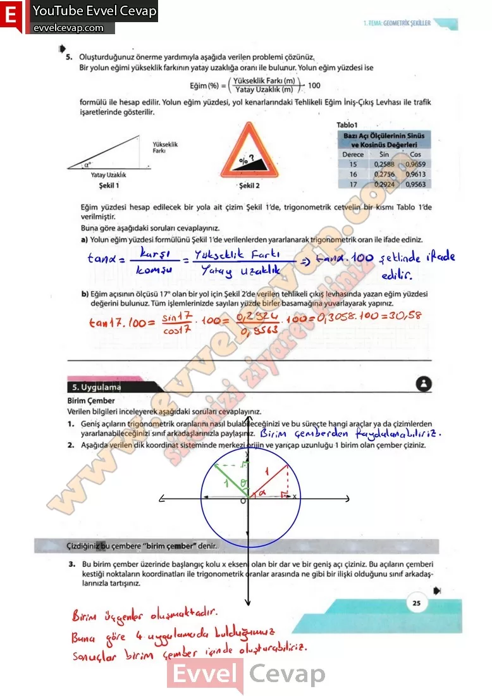

## 10. Sınıf Matematik Ders Kitabı Cevapları Meb Yayınları Sayfa 25

**Soru: 5) Oluşturduğunuz önerme yardımıyla aşağıda verilen problemi çözünüz. Bir yolun eğimi yükseklik farkının yatay uzaklığa oranı ile bulunur. Yolun eğim yüzdesi ise formülü ile hesap edilir. Yolun eğim yüzdesi, yol kenarlarındaki Tehlikeli Eğim İniş-Çıkış Levhası ile trafik işaretlerinde gösterilir. Eğim yüzdesi hesap edilecek bir yola ait çizim Şekil 1’de trigonometrik cetvelin bir kısmı Tablo 1’de verilmiştir; Buna göre aşağıdaki soruları cevaplayınız.**

**Soru: a) Yolun eğim yüzdesi, formülünü Şekil 1 ‘de verilenlerden yararlanarak trigonometrik oran ile ifade ediniz.**

**Soru: b) Eğim açısının ölçüsü 17° olan bir yol için Şekil 2’de verilen tehlikeli çıkış levhasında yazan eğim yüzdesi değerini bulunuz. Tüm işlemlerinizde sayıları yüzde birler basamağına yuvarlayarak yapınız.**

**5. Uygulama**

**Soru: Verilen bilgileri inceleyerek aşağıdaki soruları cevaplayınız.**

**Soru: 1) Geniş açıların trigonometrik oranlarını nasıl bulabileceğinizi ve bu süreçte hangi araçlar ya da çizimlerden yararlanabileceğinizi sınıf arkadaşlarınızla paylaşınız.**

**Soru: 2) Aşağıda verilen dik koordinat sisteminde merkezi orijin ve yarıçap uzunluğu 1 birim olan çember çiziniz.**

**Soru: 3) Bu birim çember üzerinde başlangıç kolu x ekseni olan bir dar ve bir geniş açı çiziniz. Bu açıların çemberi kestiği noktaların koordinatları ile trigonometrik oranlar arasında ne gibi bir ilişki olduğunu sınıf arkadaşlarınızla tartışınız.**

**10. Sınıf Meb Yayınları Matematik Ders Kitabı Sayfa 25**