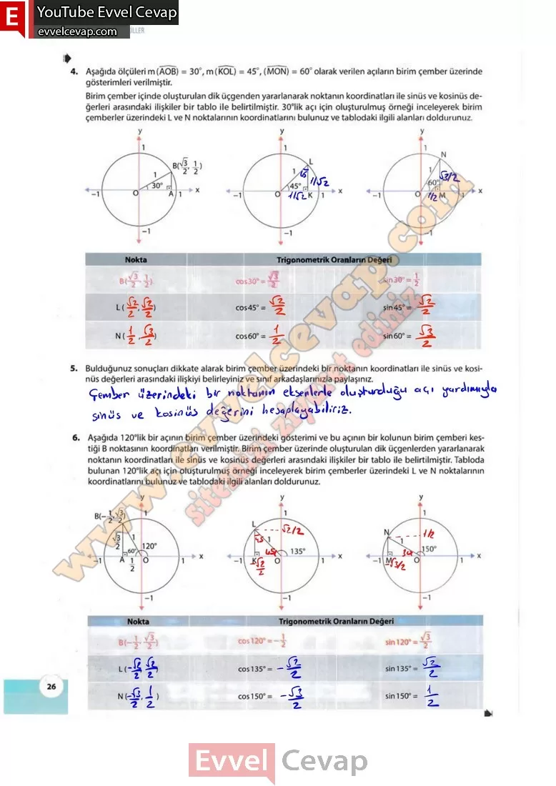

## 10. Sınıf Matematik Ders Kitabı Cevapları Meb Yayınları Sayfa 26

**Soru: 4) Aşağıda ölçüleri m (AOB) = 30°, m (KOL) = 45°, (MON) = 60° olarak verilen açıların birim çember üzerinde gösterimleri verilmiştir. Birim çember içinde oluşturulan dik üçgenden yararlanarak noktanın koordinatları ile sinüs ve kosinüs değerleri arasındaki ilişkiler bir tablo ile belirtilmiştir. 30°lik açı için oluşturulmuş örneği inceleyerek birim çemberler üzerindeki L ve N noktalarının koordinatlarını bulunuz ve tablodaki ilgili alanları doldurunuz.**

**Soru: 5) Bulduğunuz sonuçları dikkate alarak birim çember üzerindeki bir noktanın koordinatları ile sinüs ve kosinüs değerleri arasındaki ilişkiyi belirleyiniz ve sınıf arkadaşlarınızla paylaşınız.**

**Soru: 6) Aşağıda 120°lik bir açının birim çember üzerindeki gösterimi ve bu açının bir kolunun birim çemberi kestiği B noktasının koordinatları verilmiştir. Birim çember üzerinde oluşturulan dik üçgenlerden yararlanarak noktanın koordinatları ile sinüs ve kosinüs değerleri arasındaki ilişkiler bir tablo ile belirtilmiştir. Tabloda bulunan 120°lik açı için oluşturulmuş örneği inceleyerek birim çemberler üzerindeki L ve N noktalarının koordinatlarını bulunuz ve tablodaki ilgili alanları doldurunuz.**

**10. Sınıf Meb Yayınları Matematik Ders Kitabı Sayfa 26**