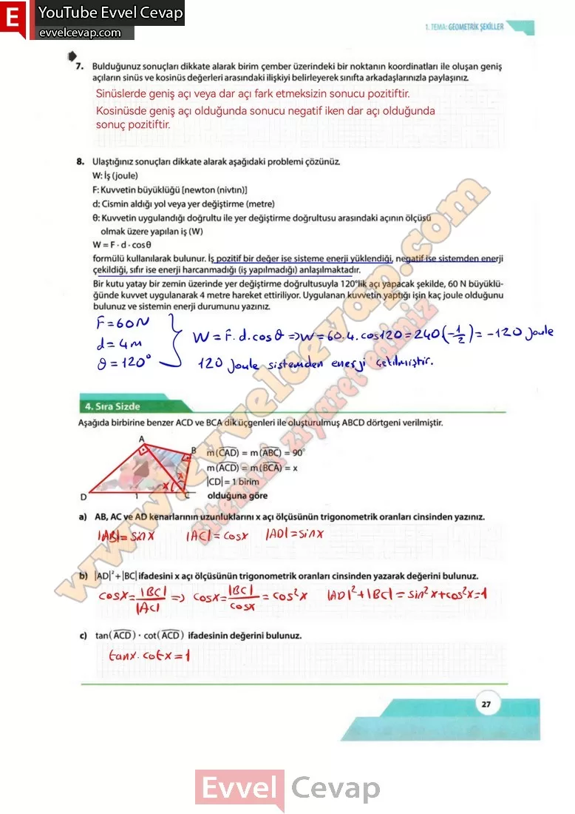

## 10. Sınıf Matematik Ders Kitabı Cevapları Meb Yayınları Sayfa 27

**Soru: 7) Bulduğunuz sonuçları dikkate alarak birim çember üzerindeki bir noktanın koordinatları ile oluşan geniş açıların sinüs ve kosinüs değerleri arasındaki ilişkiyi belirleyerek sınıfta arkadaşlarınızla paylaşınız.**

**Soru: 8) Ulaştığınız sonuçları dikkate alarak aşağıdaki problemi çözünüz.** W: İş (joule)  
 F: Kuvvetin büyüklüğü [newton (nivtın)] d: Cismin aldığı yol veya yer değiştirme (metre)  
 0: Kuvvetin uygulandığı doğrultu ile yer değiştirme doğrultusu arasındaki açının ölçüsü olmak üzere yapılan iş (W)  
 W = F • d • cos 0  
 formülü kullanılarak bulunur. İş pozitif bir değer ise sisteme enerji yüklendiği, negatif ise sistemden enerji çekildiği, sıfır ise enerji harcanmadığı (iş yapılmadığı) anlaşılmaktadır. **Bir kutu yatay bir zemin üzerinde yer değiştirme doğrultusuyla 120°lik açı yapacak şekilde, 60 N büyüklüğünde kuvvet uygulanarak 4 metre hareket ettiriliyor. Uygulanan kuvvetin yaptığı işin kaç joule olduğunu bulunuz ve sistemin enerji durumunu yazınız.**

**Sıra Sizde**

**Soru: Aşağıda birbirine benzer ACD ve BCA dik üçgenleri ile oluşturulmuş ABCD dörtgeni verilmiştir.**

**Soru: a) AB, AC ve AD kenarlarının uzunluklarını x açı ölçüsünün trigonometrik oranları cinsinden yazınız .**

**Soru: b) IADl2 + IBCI ifadesini x açı ölçüsünün trigonometrik oranları cinsinden yazarak değerini bulunuz.**

**Soru: c) tan(ACD) • cot(ACD) ifadesinin değerini bulunuz.**

**10. Sınıf Meb Yayınları Matematik Ders Kitabı Sayfa 27**