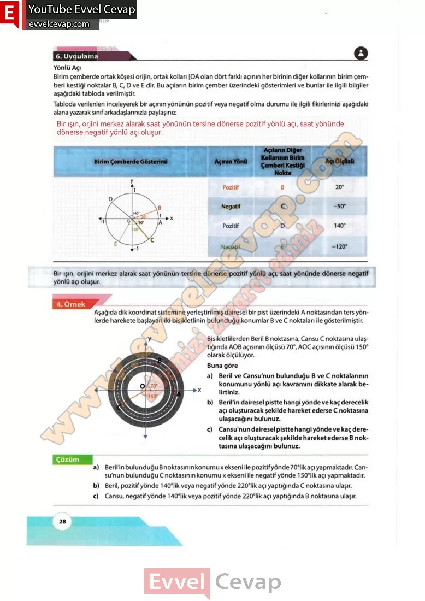

## 10. Sınıf Matematik Ders Kitabı Cevapları Meb Yayınları Sayfa 28

**6. Uygulama**

**Soru: Yönlü Açı Birim çemberde ortak köşesi orijin, ortak kolları [OA olan dört farklı açının her birinin diğer kollarının birim çemberi kestiği noktalar B, C, D ve E dir. Bu açıların birim çember üzerindeki gösterimleri ve bunlar ile ilgili bilgiler aşağıdaki tabloda verilmiştir. Tabloda verilenleri inceleyerek bir açının yönünün pozitif veya negatif olma durumu ile ilgili fikirlerinizi aşağıdaki alana yazarak sınıf arkadaşlarınızla paylaşınız.**

Aşağıda dik koordinat sistemine yerleştirilmiş dairesel bir pist üzerindeki A noktasından ters yönlerde harekete başlayan iki bisikletlinin bulunduğu konumlar B ve C noktaları ile gösterilmiştir.  
 Bisikletlilerden Beril B noktasına, Cansu C noktasına ulaştığında AOB açısının ölçüsü 70°, AOC açısının ölçüsü 150° olarak ölçülüyor.

Buna göre  
 a) Beril ve Cansu’nun bulunduğu B ve C noktalarının konumunu yönlü açı kavramını dikkate alarak belirtiniz.  
 b) Beril’in dairesel pistte hangi yönde ve kaç derecelik açı oluşturacak şekilde hareket ederse C noktasına ulaşacağını bulunuz.  
 c) Cansu’nun dairesel pistte hangi yönde ve kaç derecelik açı oluşturacak şekilde hareket ederse B noktasına ulaşacağını bulunuz.

Çözüm  
 a) Beril’in bulunduğu B noktasının konumu x ekseni ile pozitif yönde 70°likaçı yapmaktadır. Cansu’nun bulunduğu C noktasının konumu x ekseni ile negatif yönde 150°lik açı yapmaktadır.  
 b) Beril, pozitif yönde 140°lik veya negatif yönde 220°likaçı yaptığında C noktasına ulaşır.  
 c) Cansu, negatif yönde 140°lik veya pozitif yönde 220°likaçı yaptığında B noktasına

**10. Sınıf Meb Yayınları Matematik Ders Kitabı Sayfa 28**