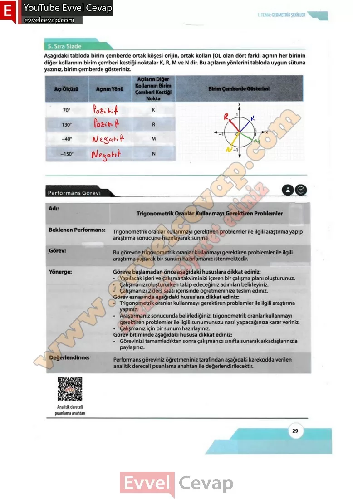

## 10. Sınıf Matematik Ders Kitabı Cevapları Meb Yayınları Sayfa 29

**Sıra Sizde**

**Soru: Aşağıdaki tabloda birim çemberde ortak köşesi orijin, ortak kolları [OL olan dört farklı açının her birinin diğer kollarının birim çemberi kestiği noktalar K, R, M ve N dir. Bu açıların yönlerini tabloda uygun sütuna yazınız, birim çemberde gösteriniz.**

**Performans Görevi**

Adı: Trigonometrik Oranlar Kullanmayı Gerektiren Problemler  
 Beklenen Performans: Trigonometrik oranlar kullanmayı gerektiren problemler ile ilgili araştırma yapıp araştırma sonucunu hazırlayarak sunma  
 Görev: Bu görevde trigonometrik oranlar kullanmayı gerektiren problemler ile ilgili araştırma yaparak bir sunum hazırlamanız istenmektedir.  
 Yönerge: Göreve başlamadan önce aşağıdaki hususlara dikkat ediniz:  
 • Yapılacak işleri ve çalışma takviminizi içeren bir çalışma planı oluşturunuz.  
 • Çalışmanızı oluştururken takip edeceğiniz adımları belirleyiniz.  
 • Çalışmanızı 2 ders saati içerisinde öğretmeninize teslim ediniz.  
 Görev esnasında aşağıdaki hususlara dikkat ediniz:  
 • Trigonometrik oranlar kullanmayı gerektiren problemler ile ilgili araştırma yapınız.  
 • Araştırmanız sonucunda belirlediğiniz, trigonometrik oranlar kullanmayı gerektiren problemler ile ilgili sunumunuzu nasıl yapacağınıza karar veriniz.  
 • Çalışmanız için bir sunum hazırlayınız.

**Soru: Görevinizi tamamladıktan sonra çalışmanızı sınıfta sunarak arkadaşlarınızla paylaşınız.**

**Soru: Performans göreviniz öğretmeniniz tarafından aşağıdaki karekodda verilen analitik dereceli puanlama anahtarı ile değerlendirilecektir.**

**10. Sınıf Meb Yayınları Matematik Ders Kitabı Sayfa 29**