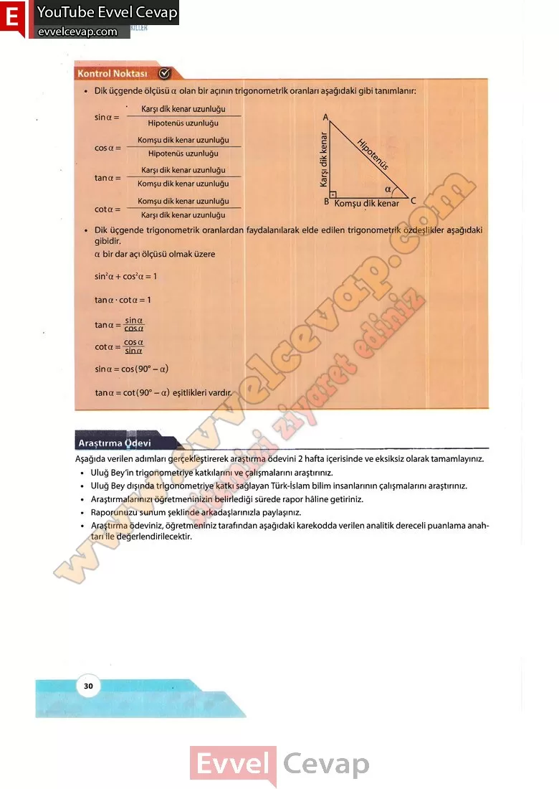

## 10. Sınıf Matematik Ders Kitabı Cevapları Meb Yayınları Sayfa 30

Dik üçgende ölçüsü a olan bir açının trigonometrik oranları aşağıdaki gibi tanımlanır:  
 Dik üçgende trigonometrik oranlardan faydalanılarak elde edilen trigonometrik özdeşlikler aşağıdaki gibidir.  
 a bir dar açı ölçüsü olmak üzere sin2a + cos2a = 1 tana- cota = 1  
 tana = cota = sina = cos(90°-a)  
 tana = cot(90° – a) eşitlikleri vardır.

**Araştırma Ödevi**

**Soru: Aşağıda verilen adımları gerçekleştirerek araştırma ödevini 2 hafta içerisinde ve eksiksiz olarak tamamlayınız.**

**Soru: Uluğ Bey’in trigonometriye katkılarını ve çalışmalarını araştırınız.**

**Soru: Uluğ Bey dışında trigonometriye katkı sağlayan Türk-İslam bilim insanlarının çalışmalarını araştırınız.**

**Soru: Araştırmalarınızı öğretmeninizin belirlediği sürede rapor hâline getiriniz.**

**Soru: Raporunuzu sunum şeklinde arkadaşlarınızla paylaşınız.**

**Soru: Araştırma ödeviniz, öğretmeniniz tarafından aşağıdaki karekodda verilen analitik dereceli puanlama anahtarı ile değerlendirilecektir.**

**10. Sınıf Meb Yayınları Matematik Ders Kitabı Sayfa 30**