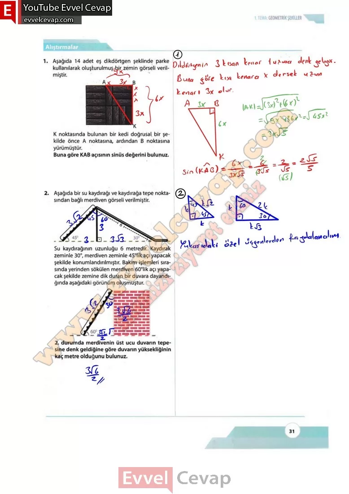
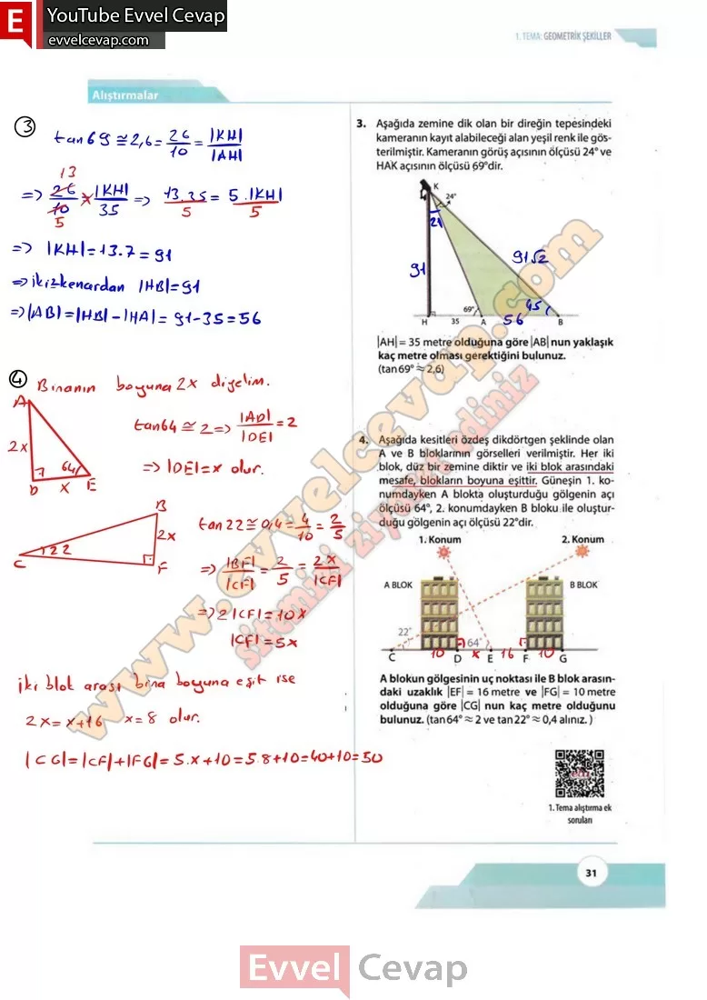

## 10. Sınıf Matematik Ders Kitabı Cevapları Meb Yayınları Sayfa 31

**Alıştırmalar**

**Soru: 1) Aşağıda 14 adet eş dikdörtgen şeklinde parke kullanılarak oluşturulmuş bir zemin görseli verilmiştir. K noktasında bulunan bir kedi doğrusal, bir şekilde önce A noktasına, ardından B noktasına yürümüştür. Buna göre KAB açısının sinüs değerini bulunuz.**

**Soru: 2)** Aşağıda bir su kaydırağı ye kaydırağa tepe noktasından bağlı merdiven görseli verilmiştir. Su kaydırağının uzunluğu 6 metredir. Kaydırak zeminle 30°, merdiven zeminle 45°lik açı yapacak şekilde konumlandırılmıştır. Bakım işlemleri sırasında yerinden sökülen merdiven 60°lik açı yapacak şekilde zemine dik duran bir duvara dayandığında aşağıdaki görünüm oluşmuştur. **2. durumda merdivenin üst ucu duvarın tepesine denk geldiğine göre duvarın yüksekliğinin kaç metre olduğunu bulunuz.**

**Soru: 3) Aşağıda zemine dik olan bir direğin tepesindeki kameranın kayıt alabileceği alan yeşil renk ile gösterilmiştir. Kameranın görüş açısının ölçüsü 24° ve HAK açısının ölçüsü 69°dir. |AH| = 35 metre olduğuna göre |AB| nun yaklaşık kaç metre olması gerektiğini bulunuz.**

**Soru: 4) Aşağıda kesitleri özdeş dikdörtgen şeklinde olan A ve B bloklarının görselleri verilmiştir. Her iki blok, düz bir zemine diktir ve iki blok arasındaki mesafe, blokların boyuna eşittir. Güneşin T, konumdayken A blokta oluşturduğu gölgenin açı ölçüsü 64Q, 2. konumdayken B bloku ile oluşturduğu gölgenin açı ölçüsü 22°dir. A blokun gölgesinin uç noktası ile B blok arasındaki uzaklık |EF|= 16 metre ve ‘|FG|= 10 metre olduğuna göre |CG| nun kaç metre olduğunu bulunuz.**

  
 

**10. Sınıf Meb Yayınları Matematik Ders Kitabı Sayfa 31**