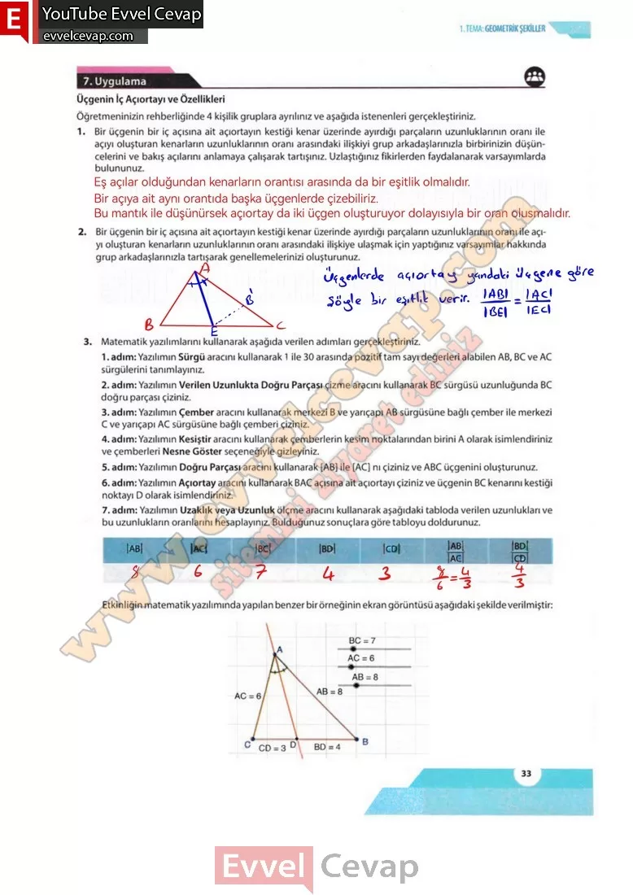

## 10. Sınıf Matematik Ders Kitabı Cevapları Meb Yayınları Sayfa 33

**7. Uygulama**

**Üçgenin İç Açıortayı ve Özellikleri**

**Soru: Öğretmeninizin rehberliğinde 4 kişilik gruplara ayrılınız ve aşağıda istenenleri gerçekleştiriniz.**

**Soru: 1) Bir üçgenin bir iç açısına ait açıortayın kestiği kenar üzerinde ayırdığı parçaların uzunluklarının oranı ile açıyı oluşturan kenarların uzunluklarının oranı arasındaki ilişkiyi grup arkadaşlarınızla birbirinizin düşüncelerini ve bakış açılarını anlamaya çalışarak tartışınız. Uzlaştığınız fikirlerden faydalanarak varsayımlarda bulununuz.**

**Soru: 2) Bir üçgenin bir iç açısına ait açıortayın kestiği kenar üzerinde ayırdığı parçaların uzunluklarının oranı ile açıyı oluşturan kenarların uzunluklarının oranı arasındaki ilişkiye ulaşmak için yaptığınız varsayımlar hakkında grup arkadaşlarınızla tartışarak genellemelerinizi oluşturunuz.**

**Soru: 3) Matematik yazılımlarını kullanarak aşağıda verilen adımları gerçekleştiriniz.**

1. adım: Yazılımın Sürgü aracını kullanarak 1 ile 30 arasında pozitif tam sayı değerleri alabilen AB, BC ve AC sürgülerini tanımlayınız.  
 2. adım: Yazılımın Verilen Uzunlukta Doğru Parçası çizme aracını kullanarak BC sürgüsü uzunluğunda BC doğru parçası çiziniz.  
 3. adım: Yazılımın Çember aracını kullanarak merkezi B ve yarıçapı AB sürgüsüne bağlı çember ile merkezi C ve yarıçapı AC sürgüsüne bağlı çemberi çiziniz.  
 4. adım: Yazılımın Kesiştir aracını kullanarak çemberlerin kesim noktalarından birini A olarak isimlendiriniz ve çemberleri Nesne Göster seçeneğiyle gizleyiniz.  
 5. adım: Yazılımın Doğru Parçası aracını kullanarak [AB] ile [AC] nı çiziniz ve ABC üçgenini oluşturunuz.  
 6. adım: Yazılımın Açıortay aracını kullanarak BAC açısına ait açıortayı çiziniz ve üçgenin BC kenarını kestiği noktayı D olarak isimlendiriniz.  
 7. adım: Yazılımın Uzaklık veya Uzunluk ölçme aracını kullanarak aşağıdaki tabloda verilen uzunlukları ve bu uzunlukların oranlarını hesaplayınız. Bulduğunuz sonuçlara göre tabloyu doldurunuz.

**10. Sınıf Meb Yayınları Matematik Ders Kitabı Sayfa 33**