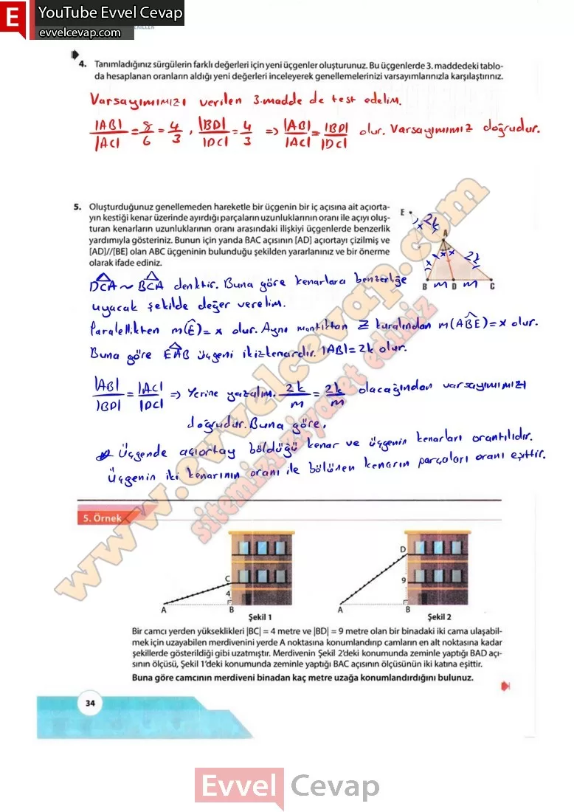
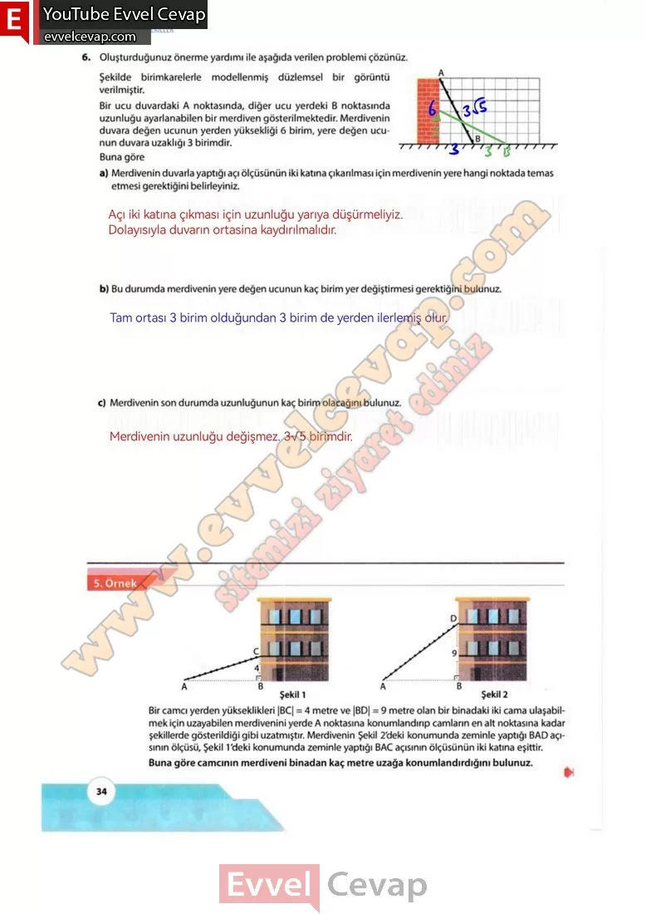

## 10. Sınıf Matematik Ders Kitabı Cevapları Meb Yayınları Sayfa 34

**Soru: 4) Tanımladığınız sürgülerin farklı değerleri için yeni üçgenler oluşturunuz. Bu üçgenlerde 3. maddedeki tabloda hesaplanan oranların aldığı yeni değerleri inceleyerek genellemelerinizi varsayımlarınızla karşılaştırınız.**

**Soru: 5) Oluşturduğunuz genellemeden hareketle bir üçgenin bir iç açısına ait açıortayın kestiği kenar üzerinde ayırdığı parçaların uzunluklarının oranı ile açıyı oluşturan kenarların uzunluklarının oranı arasındaki ilişkiyi üçgenlerde benzerlik yardımıyla gösteriniz. Bunun için yanda BAC açısının [AD] açıortayı çizilmiş ve [AD]//[BE] olan ABC üçgeninin bulunduğu şekilden yararlanınız ve bir önerme olarak ifade ediniz.**

**Soru: 6) Oluşturduğunuz önerme yardımı ile aşağıda verilen problemi çözünüz. Şekilde birimkarelerle modellenmiş düzlemsel bîr görüntü verilmiştir.** **Bir ucu duvardaki A noktasında, diğer ucu yerdeki B noktasında uzunluğu ayarlanabilen bir merdiven gösterilmektedir. Merdivenin duvara değen ucunun yerden yüksekliği 6 birim, yere değen ucunun duvara uzaklığı 3 birimdir. Buna göre**

**Soru: a) Merdivenin duvarla yaptığı açı ölçüsünün iki katına çıkarılması için merdivenin yere hangi noktada temas etmesi gerektiğini belirleyiniz.**

**Soru: b) Bu durumda merdivenin yere değen ucunun kaç birim yer değiştirmesi gerektiğini bulunuz.**

**Soru: c) Merdivenin son durumda uzunluğunun kaç birim olacağım bulunuz.**

  
 

**10. Sınıf Meb Yayınları Matematik Ders Kitabı Sayfa 34**