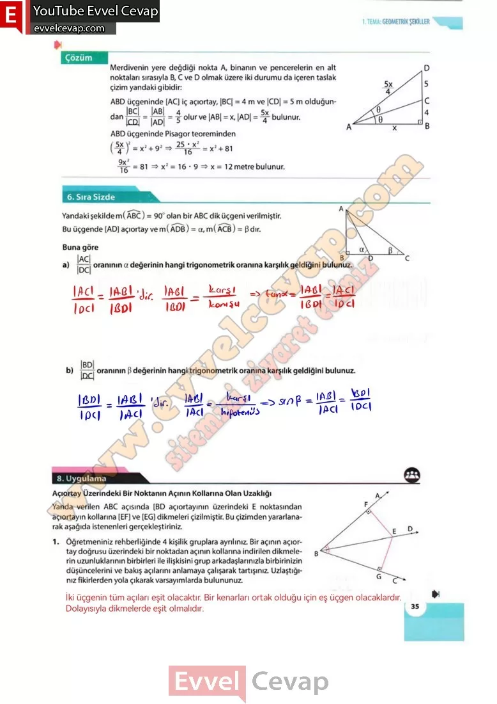

## 10. Sınıf Matematik Ders Kitabı Cevapları Meb Yayınları Sayfa 35

**6. Sıra Sizde**

**Soru: Yandaki şekilde m( ABC) = 90° olan bir ABC dik üçgeni verilmiştir. Bu üçgende [AD] açıortay ve m(ADB) = a, m(ACB) = 3 Buna göre**

**Soru: a) IACI/IDCI  oranının a değerinin hangi trigonometrik oranına karşılık geldiğini bulunuz.**

**Soru: b) IBDI/IDCI oranının β değerinin hangi trigonometrik oranına karşılık geldiğini bulunuz.**

**8. Uygulama**

**Açıortay Üzerindeki Bir Noktanın Açının Kollarına Olan Uzaklığı**

**Soru: Yanda verilen ABC açısında [BD açıortayının üzerindeki E noktasından açıortayın kollarına [EF] ve [EG] dikmeleri çizilmiştir. Bu çizimden yararlanarak aşağıda istenenleri gerçekleştiriniz.**

**Soru: 1) Öğretmeniniz rehberliğinde 4 kişilik gruplara ayrılınız. Bir açının açıortay doğrusu üzerindeki bir noktadan açının kollarına indirilen dikmelerin uzunluklarının birbirleri ile ilişkisini grup arkadaşlarınızla birbirinizin düşüncelerini ve bakış açılarını anlamaya çalışarak tartışınız. Uzlaştığınız fikirlerden yola çıkarak varsayımlarda bulununuz.**

**10. Sınıf Meb Yayınları Matematik Ders Kitabı Sayfa 35**