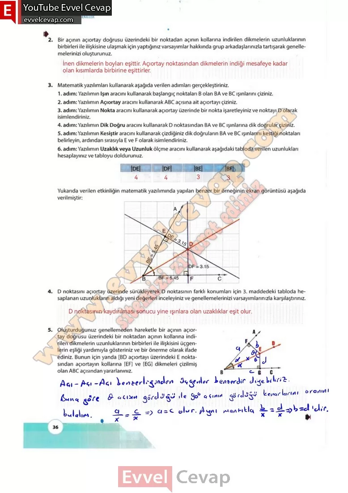

## 10. Sınıf Matematik Ders Kitabı Cevapları Meb Yayınları Sayfa 36

**Soru: 2) Bir açının açıortay doğrusu üzerindeki bir noktadan açının kollarına indirilen dikmelerin uzunluklarının birbirleri ile ilişkisine ulaşmak için yaptığınız varsayımlar hakkında grup arkadaşlarınızla tartışarak genellemelerinizi oluşturunuz.**

**Soru: 3) Matematik yazılımları kullanarak aşağıda verilen adımları gerçekleştiriniz.**

1. adım: Yazılımın Işın aracını kullanarak başlangıç noktaları B olan BA ve BC ışınlarını çiziniz.  
 2. adım: Yazılımın Açıortay aracını kullanarak ABC açısına ait açıortayı çiziniz.  
 3. adım: Yazılımın Nokta aracını kullanarak açıortay üzerinde bir nokta işaretleyiniz ve noktayı D olarak isimlendiriniz.  
 4. adım: Yazılımın Dik Doğru aracını kullanarak D noktasından BA ve BC ışınlarına dik doğrular çiziniz.  
 5. adım: Yazılımın Kesiştir aracını kullanarak çizdiğiniz dik doğruların BA ve BC ışınlarını kestiği noktaları belirleyin, ardından sırasıyla E ve F olarak isimlendiriniz.  
 6. adım: Yazılımın Uzaklık veya Uzunluk ölçme aracını kullanarak aşağıdaki tabloda verilen uzunlukları hesaplayınız ve tabloyu doldurunuz.  
 Yukarıda verilen etkinliğin matematik yazılımında yapılan benzer bir örneğinin ekran görüntüsü aşağıda verilmiştir:

**Soru: 4) D noktasını açıortay üzerinde sürükleyerek D noktasının farklı konumları için 3. maddedeki tabloda hesaplanan uzunlukların aldığı yeni değerleri inceleyiniz ve genellemelerinizi varsayımlarınızla karşılaştırınız.**

**Soru: 5) Oluşturduğunuz genellemeden hareketle bir açının açıortay doğrusu üzerindeki bir noktadan açının kollarına indirilen dikmelerin uzunluklarının birbirleri ile ilişkisini üçgenlerin eşliği yardımıyla gösteriniz ve bir önerme olarak ifade ediniz. Bunun için yanda [BD açıortayı üzerindeki E noktasından açıortayın kollarına [EF] ve [EG] dikmeleri çizilmiş olan ABC açısından yararlanınız.**

**10. Sınıf Meb Yayınları Matematik Ders Kitabı Sayfa 36**