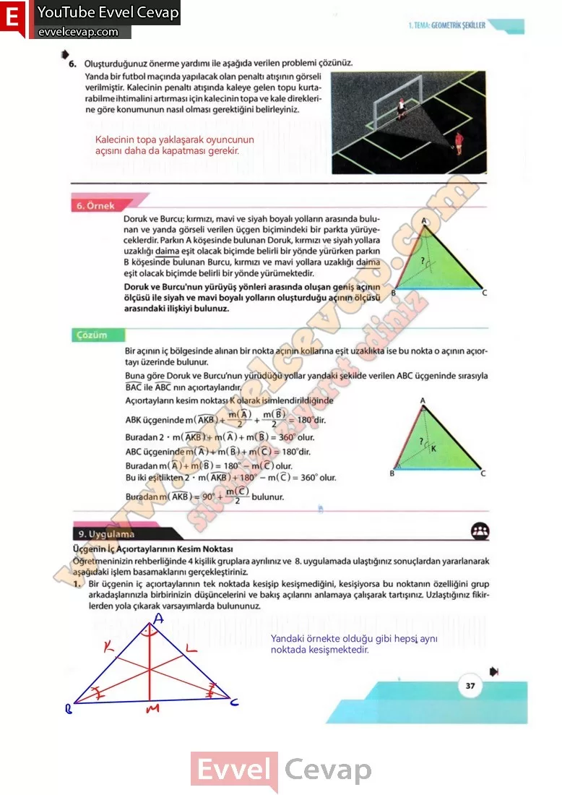

## 10. Sınıf Matematik Ders Kitabı Cevapları Meb Yayınları Sayfa 37

**Soru: 6) Oluşturduğunuz önerme yardımı ile aşağıda verilen problemi çözünüz. Yanda bir futbol maçında yapılacak olan penaltı atışının görseli verilmiştir. Kalecinin penaltı atışında kaleye gelen topu kurtarabilme ihtimalini artırması için kalecinin topa ve kale direklerine göre konumunun nasıl olması gerektiğini belirleyiniz.**

Doruk ve Burcu; kırmızı, mavi ve siyah boyalı yolların arasında bulunan ve yanda görseli verilen üçgen biçimindeki bir parkta yürüyeceklerdir. Parkın A köşesinde bulunan Doruk, kırmızı ve siyah yollara uzaklığı daima eşit olacak biçimde belirli bir yönde yürürken parkın B köşesinde bulunan Burcu, kırmızı ve mavi yollara uzaklığı daima eşit olacak biçimde belirli bir yönde yürümektedir.  
 Doruk ve Burcu’nun yürüyüş yönleri arasında oluşan geniş açının ölçüsü ile siyah ve mavi boyalı yolların oluşturduğu açının ölçüsü arasındaki ilişkiyi bulunuz.

Bir açının iç bölgesinde alınan bir nokta açının kollarına eşit uzaklıkta ise bu nokta o açının açıortayı üzerinde bulunur.  
 Buna göre Doruk ve Burcu’nun yürüdüğü yollar yandaki şekilde verilen ABC üçgeninde sırasıyla BAC ile ABC nın açıortaylarıdır.

**9. UYGULAMA**

**Üçgenin İç Açıortaylarının Kesim Noktası**

**Soru: Öğretmeninizin rehberliğinde 4 kişilik gruplara ayrılınız ve 8. uygulamada ulaştığınız sonuçlardan yararlanarak aşağıdaki işlem basamaklarını gerçekleştiriniz.**

**Soru: 1) Bir üçgenin iç açıortaylarının tek noktada kesişip kesişmediğini, kesişiyorsa bu noktanın özelliğini grup arkadaşlarınızla birbirinizin düşüncelerini ve bakış açılarını anlamaya çalışarak tartışınız. Uzlaştığınız fikirlerden yola çıkarak varsayımlarda bulununuz.**

**10. Sınıf Meb Yayınları Matematik Ders Kitabı Sayfa 37**