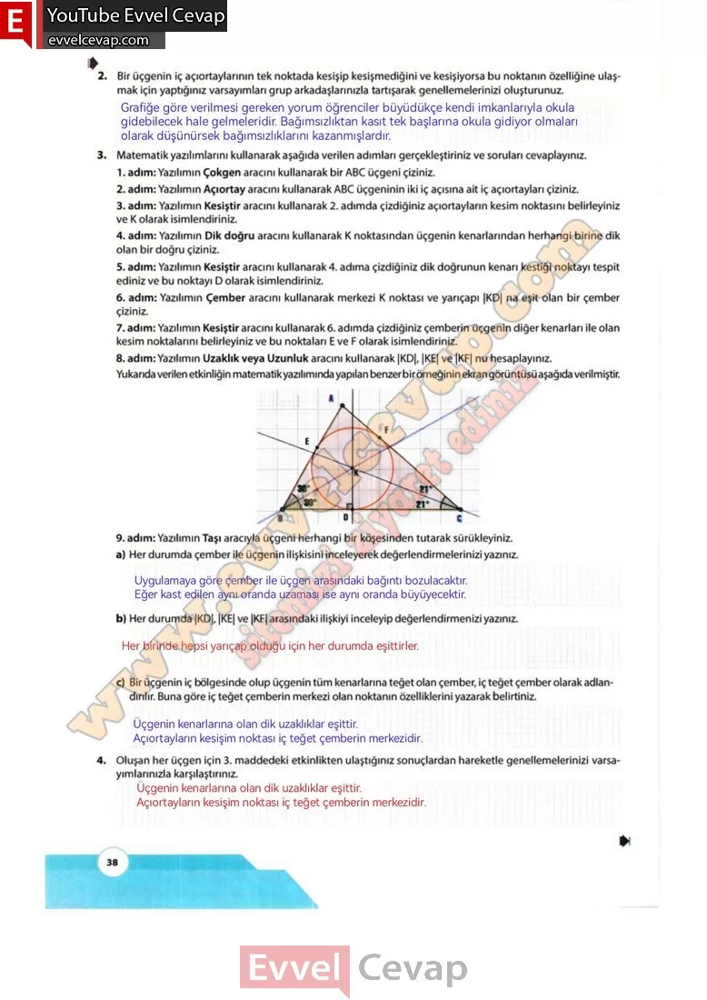

## 10. Sınıf Matematik Ders Kitabı Cevapları Meb Yayınları Sayfa 38

**Soru: 2) Bir üçgenin iç açıortaylarının tek noktada kesişip kesişmediğini ve kesişiyorsa bu noktanın özelliğine ulaşmak için yaptığınız varsayımları grup arkadaşlarınızla tartışarak genellemelerinizi oluşturunuz.**

**Soru: 3) Matematik yazılımlarını kullanarak aşağıda verilen adımları gerçekleştiriniz ve soruları cevaplayınız.**

1. adım: Yazılımın Çokgen aracını kullanarak bir ABC üçgeni çiziniz.  
 2. adım: Yazılımın Açıortay aracını kullanarak ABC üçgeninin iki iç açısına ait iç açıortayları çiziniz.  
 3. adım: Yazılımın Kesiştir aracını kullanarak 2. adımda çizdiğiniz açıortayların kesim noktasını belirleyiniz ve K olarak isimlendiriniz.  
 4. adım: Yazılımın Dik doğru aracını kullanarak K noktasından üçgenin kenarlarından herhangi birine dik olan bir doğru çiziniz.  
 5. adım: Yazılımın Kesiştir aracını kullanarak 4. adıma çizdiğiniz dik doğrunun kenarı kestiği noktayı tespit ediniz ve bu noktayı D olarak isimlendiriniz.  
 6. adım: Yazılımın Çember aracını kullanarak merkezi K noktası ve yarıçapı |KD| na eşit olan bir çember çiziniz.  
 7. adım: Yazılımın Kesiştir aracını kullanarak 6. adımda çizdiğiniz çemberin üçgenin diğer kenarları ile olan kesim noktalarını belirleyiniz ve bu noktaları E ve F olarak isimlendiriniz.  
 8. adım: Yazılımın Uzaklık veya Uzunluk aracını kullanarak |KD|, |KE| ve |KF| nu hesaplayınız.

**Soru: a) Her durumda çember ile üçgenin ilişkisini inceleyerek değerlendirmelerinizi yazınız.**

**Soru: b) Her durumda |KD|, |KE| ve |KF| arasındaki ilişkiyi inceleyip değerlendirmenizi yazınız.**

**Soru: c) Bir üçgenin iç bölgesinde olup üçgenin tüm kenarlarına teğet olan çember, iç teğet çember olarak adlandırılır. Buna göre iç teğet çemberin merkezi olan noktanın özelliklerini yazarak belirtiniz.**

**Soru: 4) Oluşan her üçgen için 3. maddedeki etkinlikten ulaştığınız sonuçlardan hareketle genellemelerinizi varsayımlarınızla karşılaştırınız.**

**10. Sınıf Meb Yayınları Matematik Ders Kitabı Sayfa 38**