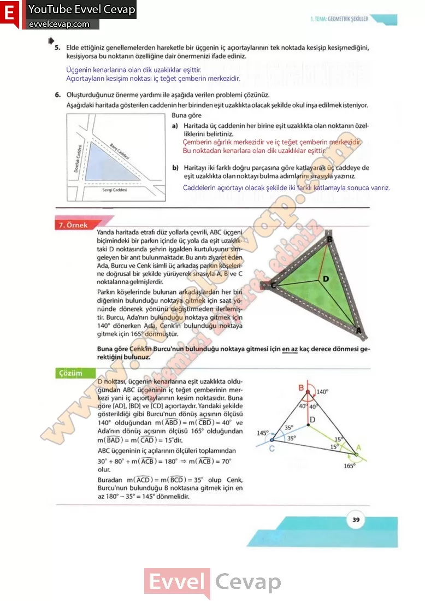

## 10. Sınıf Matematik Ders Kitabı Cevapları Meb Yayınları Sayfa 39

**Soru: 5) Elde ettiğiniz genellemelerden hareketle bir üçgenin iç açıortaylarının tek noktada kesişip kesişmediğini, kesişiyorsa bu noktanın özelliğine dair önermenizi ifade ediniz.**

**Soru: 6) Oluşturduğunuz önerme yardımı ile aşağıda verilen problemi çözünüz.**

**Soru: Aşağıdaki haritada gösterilen caddenin her birinden eşit uzaklıkta olacak şekilde okul inşa edilmek isteniyor. Buna göre**

**Soru: a) Haritada üç caddenin her birine eşit uzaklıkta olan noktanın özelliklerini belirtiniz.**

**Soru: b) Haritayı iki farklı doğru parçasına göre katlayarak üç caddeye de eşit uzaklıkta olan noktayı bulma adımlarını sırasıyla yazınız.**

**10. Sınıf Meb Yayınları Matematik Ders Kitabı Sayfa 39**