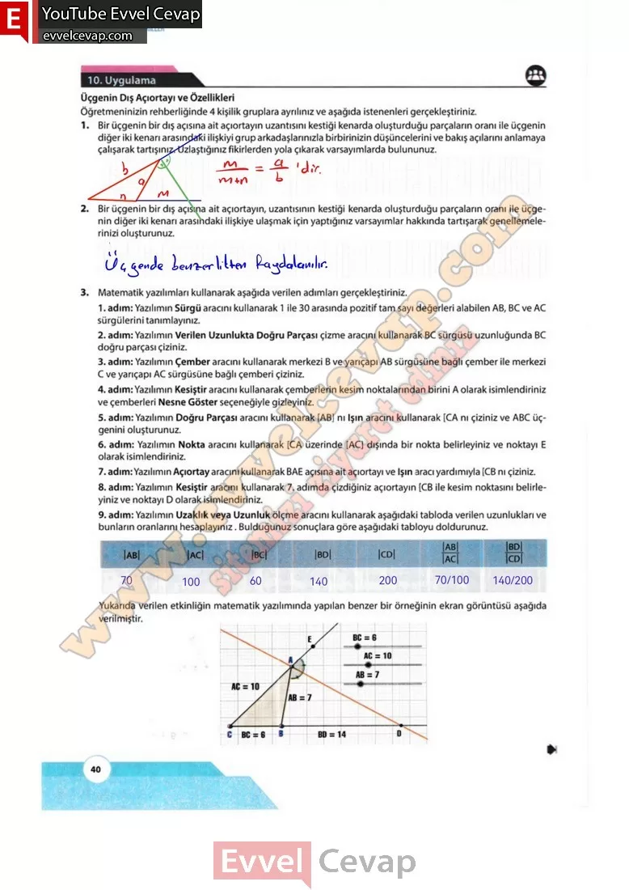

## 10. Sınıf Matematik Ders Kitabı Cevapları Meb Yayınları Sayfa 40

**10. Uygulama**

**Soru: Öğretmeninizin rehberliğinde 4 kişilik gruplara ayrılınız ve aşağıda istenenleri gerçekleştiriniz.**

**Soru: 1) Bir üçgenin bir dış açısına ait açıortayın uzantısını kestiği kenarda oluşturduğu parçaların oranı ile üçgenin diğer iki kenarı arasındaki ilişkiyi grup arkadaşlarınızla birbirinizin düşüncelerini ve bakış açılarını anlamaya çalışarak tartışınız. Uzlaştığınız fikirlerden yola çıkarak varsayımlarda bulununuz.**

**Soru: 2) Bir üçgenin bir dış açısına ait açıortayın, uzantısının kestiği kenarda oluşturduğu parçaların oranı ile üçgenin diğer iki kenarı arasındaki ilişkiye ulaşmak için yaptığınız varsayımlar hakkında tartışarak genellemelerinizi oluşturunuz.**

**Soru: 3) Matematik yazılımları kullanarak aşağıda verilen adımları gerçekleştiriniz.**

1. adım: Yazılımın Sürgü aracını kullanarak 1 ile 30 arasında pozitif tam sayı değerleri alabilen AB, BC ve AC sürgülerini tanımlayınız.  
 2. adım: Yazılımın Verilen Uzunlukta Doğru Parçası çizme aracını kullanarak BC sürgüsü uzunluğunda BC doğru parçası çiziniz.  
 3. adım: Yazılımın Çember aracını kullanarak merkezi B ve yarıçapı AB sürgüsüne bağlı çember ile merkezi C ve yarıçapı AC sürgüsüne bağlı çemberi çiziniz.  
 4. adım: Yazılımın Kesiştir aracını kullanarak çemberlerin kesim noktalarından birini A olarak isimlendiriniz ve çemberleri Nesne Göster seçeneğiyle gizleyiniz.  
 5. adım: Yazılımın Doğru Parçası aracını kullanarak [AB] nı Işın aracını kullanarak [CA nı çiziniz ve ABC üçgenini oluşturunuz.  
 6. adım: Yazılımın Nokta aracını kullanarak [CA üzerinde [AC] dışında bir nokta belirleyiniz ve noktayı E olarak isimlendiriniz.  
 7. adım: Yazılımın Açıortay aracını kullanarak BAE açısına ait açıortayı ve Işın aracı yardımıyla [CB nı çiziniz.  
 8. adım: Yazılımın Kesiştir aracını kullanarak 7. adımda çizdiğiniz açıortayın [CB ile kesim noktasını belirleyiniz ve noktayı D olarak isimlendiriniz.  
 9. adım: Yazılımın Uzaklık veya Uzunluk ölçme aracını kullanarak aşağıdaki tabloda verilen uzunlukları ve bunların oranlarını hesaplayınız. Bulduğunuz sonuçlara göre aşağıdaki tabloyu doldurunuz.

**10. Sınıf Meb Yayınları Matematik Ders Kitabı Sayfa 40**