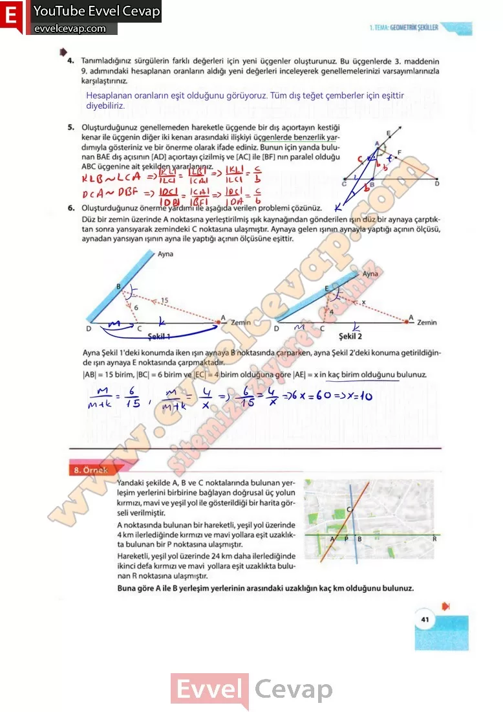

## 10. Sınıf Matematik Ders Kitabı Cevapları Meb Yayınları Sayfa 41

**Soru: 4) Tanımladığınız sürgülerin farklı değerleri için yeni üçgenler oluşturunuz. Bu üçgenlerde 3. maddenin 9. adımındaki hesaplanan oranların aldığı yeni değerleri inceleyerek genellemelerinizi varsayımlarınızla karşılaştırınız.**

**Soru: 5) Oluşturduğunuz genellemeden hareketle üçgende bir dış açıortayın kestiği kenar ile üçgenin diğer iki kenarı arasındaki ilişkiyi üçgenlerde benzerlik yardımıyla gösteriniz ve bir önerme olarak ifade ediniz. Bunun için yanda bulunan BAE dış açısının [AD] açıortayı çizilmiş ve [AC] ile [BF] nın paralel olduğu ABC üçgenine ait şekilden yararlanınız.**

**Soru: 6)** Oluşturduğunuz önerme yardımı ile aşağıda verilen problemi çözünüz. Düz bir zemin üzerinde A noktasına yerleştirilmiş ışık kaynağından gönderilen ışın düz bir aynaya çarptıktan sonra yansıyarak zemindeki C noktasına ulaşmıştır. **Aynaya gelen ışının aynayla yaptığı açının ölçüsü, aynadan yansıyan ışının ayna ile yaptığı açının ölçüsüne eşittir. Ayna Şekil 1 ‘deki konumda iken ışın aynaya B noktasında çarparken, ayna Şekil 2’deki konuma getirildiğinde ışın aynaya E noktasında çarpmaktadır. |AB| = 15 birim, |BC| = 6 birim ve |EC| = 4 birim olduğuna göre |AE| = x in kaç birim olduğunu bulunuz.**

Yandaki şekilde A, B ve C noktalarında bulunan yerleşim yerlerini birbirine bağlayan doğrusal üç yolun kırmızı, mavi ve yeşil yol ile gösterildiği bir harita görseli verilmiştir.  
 A noktasında bulunan bir hareketli, yeşil yol üzerinde 4 km ilerlediğinde kırmızı ve mavi yollara eşit uzaklıkta bulunan bir P noktasına ulaşmıştır.  
 Hareketli, yeşil yol üzerinde 24 km daha ilerlediğinde ikinci defa kırmızı ve mavi yollara eşit uzaklıkta bulunan R noktasına ulaşmıştır.  
 Buna göre A ile B yerleşim yerlerinin arasındaki uzaklığın kaç km olduğunu bulunuz.

**10. Sınıf Meb Yayınları Matematik Ders Kitabı Sayfa 41**